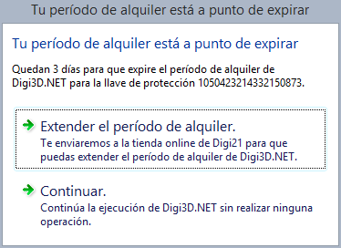

# Alquileres

Si ya dispones de una llave de protección (por hardware o software), puedes alquilar alguna licencia de nuestros programas. Para ello será necesario que tengas a mano el _Key ID_ de tu llave de protección. Puedes obtener el _KeyID_ de tu llave de protección haciendo clic en el siguiente enlace: [Sentinel Keys](http://localhost:1947/\_int\_/devices.html).

En la siguiente tabla te mostramos las versiones que podrás utilizar cuando alquilas un programa:

| Tipo de licencia | Fecha máxima de uso               | Versión del programa                    | Requisito para comprar |
| ---------------- | --------------------------------- | --------------------------------------- | ---------------------- |
| Alquiler         | Hasta la fecha máxima de alquiler | Siempre la última versión del programa. | Ninguno                |

El proceso de alquiler es muy sencillo:

1. Compra un alquiler en nuestra [tienda de alquileres](http://www.digi21.net/Tienda/Alquiler).
2. Espera a que te llegue un correo electrónico con el título **Confirmación de alquiler** en el que te indicaremos que lo tenemos todo preparado. Si no te llega este correo inmediatamente no nos llames ni nos envíes ningún correo, puede tardar un poco.
3. Ejecuta el programa [Consolidar alquiler](/acerca-llaves-proteccion/programas-relacionados-con-licencias-y-llaves-de-proteccion/consolidar-alquiler.md) que almacenará las licencias en tu llave de protección.

## Aviso de que el alquiler está a punto de expirar

7 días antes de que expire tu período de alquiler te mostraremos cada vez que ejecutes el programa una ventana indicándote el número de días restantes de alquiler para recordarte que te quedan pocos días.

A continuación, te mostramos cómo avisa _Digi3D.NET_ de que quedan pocos días de alquiler:

