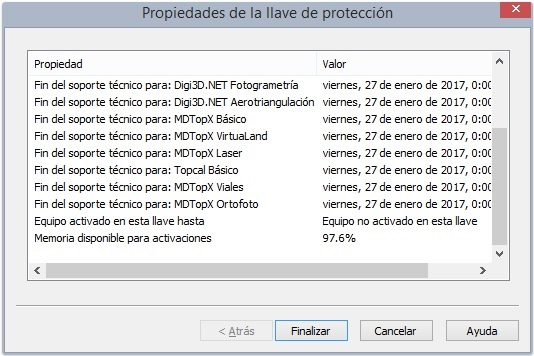

# Comprimir llave

Puedes comprimir la memoria almacenada en la llave de protección para almacenar más activaciones.

Las llaves de protección tienen memoria suficiente para almacenar unas 20 activaciones, por lo que podrás conectarla a distintos equipos y activarlos.

Si necesitas activar más de 20 ordenadores, la llave se quedará sin memoria y no quedará más remedio que eliminar las activaciones y comenzar de cero.

Con una llave mono-puesto puede que nunca te encuentres con ese problema, pero si dispones de una llave de protección de red, con 250 licencias, por ejemplo, puedes encontrarte con este problema.

Para solucionar el problema, hemos introducido a la _suite de licencias_ el programa **Comprimir llave**, que nos va a permitir comprimir la llave de protección para poder almacenar más licencias.

**Advertencia:**

Tienes que tener en cuenta, que los programas publicados con fecha anterior a 22 de junio de 2015 **no son compatibles con llaves comprimidas**, por lo que debes asegurarte de tener todos los programas actualizados antes de comprimir la llave de protección.

En el momento en el que se comprime la llave de protección, cada vez que activas una llave con el programa [Activar Ordenador](activar-ordenador.md), éste almacela las licencias de forma comprimida.

Puedes eliminar la compresión de una llave de protección eliminando todas las licencias almacenadas en éste mediante el programa [Eliminar Activaciones y Alquileres](elimina-activaciones-alquileres.md). Este programa _formatea_ la memoria destinada a las activaciones de la llave y además la deja en un estado _no comprimido_, de modo que a partir de ese momento las activaciones se realizarán sin comprimir.

Además hemos hecho que el programa [Comprobar Licencias](comprobar-licencias.md) muestre el porcentaje de memoria libre en la llave de protección:

También hemos introducido el concepto de **Contraseña de administración** en la llave de protección.  
Si entras en tu panel de administración de llaves de protección en [Mis llaves](https://www.digi21.net/MisLlaves) podrás comprobar que ha aparecido una nueva opción de configuración que te permite indicar una contraseña de administración. Los programas **Comprimir Llave** y **Eliminar Activaciones y Alquieres** solicitarán esta contraseña de activación.

