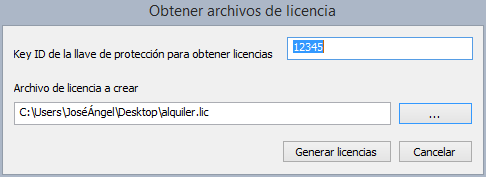

# Obtener Archivos Licencia

Este programa se comunica con el servidor de licencias de Digi21 y obtiene un archivo de licencia con los alquileres de una determinada llave.

Este archivo se puede utilizar con posterioridad con el programa [Consolidar alquiler Offline](/acerca-llaves-proteccion/programas-relacionados-con-licencias-y-llaves-de-proteccion/consolidar-alquiler-offline/) para programar los alquileres en la llave de protección.

Este programa requiere conexión a internet para obtener las licencias.

Si el equipo con la llave de protección en la que se quieren programar los alquileres dispone de conexión a internet, utiliza mejor el programa [Consolidar alquiler](/acerca-llaves-proteccion/programas-relacionados-con-licencias-y-llaves-de-proteccion/consolidar-alquiler.md) pues este programa la llave de protección sin necesidad de crear ningún archivo.

Para obtener los archivos de licencia con los alquileres que se acaban de adquirir para una determinada llave de protección sigue los siguientes pasos:

1. Ejecuta el programa **Obtener archivos licencia** que encontrarás en **Inicio/Programas/Digi21.net/Licencias/Obtener archivos de licencia**.
2. Introducir el **Key ID** de la llave de protección.
3. Indicar la ruta del archivo de licencia a crear. Los archivos de licencia tienen extensión _.lic_.
4. Pulsar el botón **Generar licencias**.

Una vez obtenido el archivo de licencia, tienes que programar la llave con el programa [Consolidar alquiler Offline](/acerca-llaves-proteccion/programas-relacionados-con-licencias-y-llaves-de-proteccion/consolidar-alquiler-offline/).
