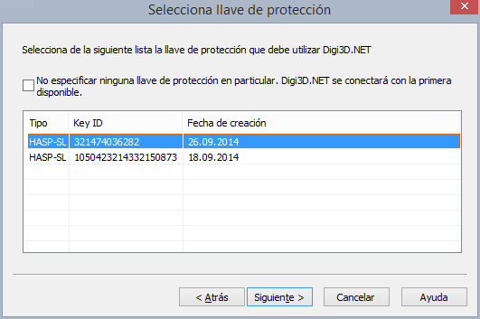

# Selecciona llave

Este programa permite especificar con qué llave de protección debe conectarse un programa en particular.

Todas nuestras aplicaciones (_Digi3D.NET, Topcal21, MDTopX_,...) instalan un programa denominado **Seleccionar Llave** que permite especificar con qué llave de protección debe conectarse el programa.

Si dispones de varias llaves de protección y no configuras una llave de protección en particular para un determinado programa, éste se conectará con la primera disponible, y es posible que la llave de protección con la que se conecte no disponga de licencia para ese programa.

Supongamos que dispones de dos llaves de protección, _A_ y _B_. En la llave _A_ tienes adquirida una licencia de _Digi3D.NET_, y en la llave de protección _B_ tienes un alquiler de _MDTopX_.\
Si no has configurado _MDTopX_ para que se conecte con la llave de protección _B_, es posible que éste al ejecutarse localice primero la llave de protección _A_, mostrándote el mensaje [Soporte técnico finalizado](/acerca-llaves-proteccion/solucion-de-problemas/soporte-tecnico-finalizado.md).

Para solucionar este problema deberás indicarle a _MDTopX_ que debe utilizar la llave de protección _B_. Esto lo puedes hacer con el programa **Seleccionar Llave** que encontrarás en _Inicio/Todos los programas/Digi21.net/MDTopX_.\
El programa **Seleccionar Llave** para configurar Digi3D.NET lo puedes encontrar en _Inicio/Todos los programas/Digi21.net/Digi3D.NET_.\
El programa **Seleccionar Llave** para configurar Topcal21 lo puedes encontrar en _Inicio/Todos los programas/Digi21.net/Topcal21_.

La página de selección de llave de protección dispone de una casilla de verificación para indicar que no quieres configurar ninguna llave en particular. Si la seleccionas y pulsas el botón **Siguiente** se eliminará la configuración para una llave en particular dejando el programa en el estado de conectarse con la primera llave de protección disponible.

En la siguiente captura de pantalla puedes ver la página de selección de llave de protección para el programa _Digi3D.NET_.

