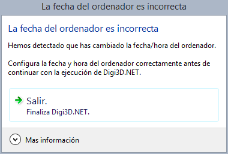

# Ordenador con fecha incorrecta

Hemos detectado que la fecha del ordenador es incorrecta con respecto a lo que habíamos almacenado en tu llave de protección.

Este error tiene tres posibles causas:

1. Que has reinstalado el sistema operativo en el ordenador y no has configurado correctamente la fecha.
2. Que has movido la llave de protección a otro ordenador y éste no tiene la fecha correcta.
3. Que has cambiado la fecha del ordenador a una fecha anterior en el tiempo.

Nuestros programas no van a funcionar si la fecha del ordenador es incorrecta para evitar que se extiendan de forma ilegal los períodos de expiración por activación, o alquiler.

Tienes que cambiar la fecha y hora del ordenador antes de utilizar cualquiera de nuestros programas.

A continuación, te mostramos cómo comunica _Digi3D.NET_ esta incidencia:

