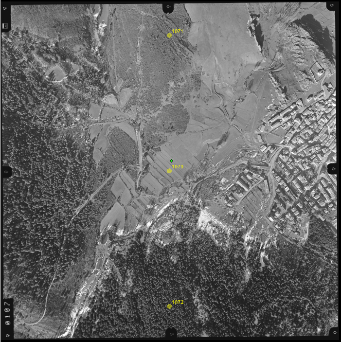
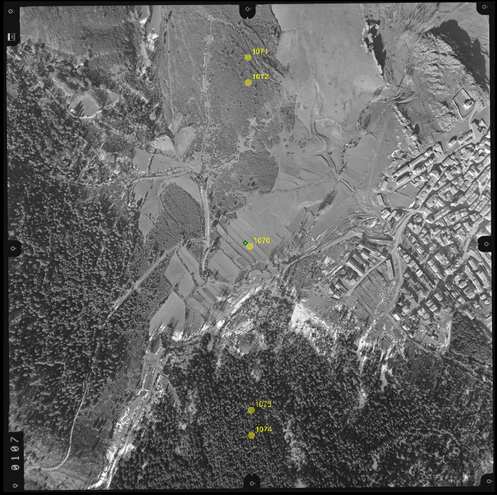

# Aerotriangulación manual

Digi3D.NET permite medir aerotriangulaciones de manera manual.

Estas aerotriangulaciones se miden de una manera muy rápida pues el programa va numerando automáticamente los puntos a medir y localiza automáticamente mediante correlación los puntos a medir, de manera que en la mayoría de los casos el operador tan solo tiene que confirmar la medida que se ha realizado automáticamente.

En este manual no te vamos a enseñar a aerotriangular, los conceptos teóricos de aerotriangulación están fuera del ámbito de este manual. Te recomendamos que te compres un libro de fotogrametría si no tienes conocimientos técnicos de aerotriangulación.

La medida de aerotriangulación en Digi3D.NET consiste en medir una serie de puntos repartidos por todo el proyecto. El proceso consiste en lo siguiente:

1. Localizar una ubicación donde medir un punto.
2. Darle un nombre al punto.
3. Medir ese punto en todos los modelos en los que solapa dicho punto.

Si proyecto está formado por varias pasadas formando un bloque mediremos al menos tres puntos por foto. Si por el contrario está formado por una única pasada, o varias pasadas en las que el único solape entre pasadas es un único modelo (como por ejemplo una traza de carretera), mediremos al menor 5 puntos por foto. Esto es así porque midiendo únicamente tres puntos si se realiza alguna medida incorrecta es posible que genere un desdoblamiento en el cálculo, y estos dessoblamientos son difíciles de detectar al analizar los resultados del progama de cálculo de aerotriangulación.

Veamos la ubicación aproximada que suelen tener los puntos en una foto si decidimos medir tres puntos por foto:

y la ubicación aproximada que suelen tener los puntos en una foto si decidimos medir cinco puntos por foto:

Los puntos se miden en todos los modelos en los que entran, de modo que si el punto _1070_ solapa tanto con el modelos _107-108_ como con el modelo _108-109_, tendremos que medirlo en ambos modelos.

El nombre del punto es importante, porque no puedes nombrar dos puntos distintos con el mismo nombre, por lo tanto se suele utilizar como nombre del punto el nombre de la foto que lo aportó y un identificador que identifique el punto dentro de la foto.

En el ejemplo anterior (el de tres puntos) numera los puntos de la siguiente manera:

| Nombre del punto | Ubicación del punto           |
| ---------------- | ----------------------------- |
| 107 + 0 = 1070   | Centro de la foto 107         |
| 107 + 1 = 1071   | Parte superior de la foto 107 |
| 107 + 2 = 1072   | Parte inferior de la foto 107 |

De esta manera ses fácil de saber que el punto _1092_ es el punto aportado por la foto _109_ y está ubicado en su parte inferior.
