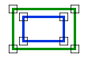

# CompletelyWithin

 está completamente incluida en la segunda área de tipo Espacio de nombres: [Digi21.DigiNG.Entities.Relations](../../)  
Ensamblado: [Digi21.DigiNG](../../../)

Indica si la primera área está completamente dentro dela segunda área.



## Sobrecargas

|  |  |
| :--- | :--- |
| [CompletelyWithin\(ReadOnlyLine, ReadOnlyLine\)](completelywithin.md#completelywithin-readonlyline-readonlyline) | Indica si la primera área de tipo [ReadOnlyLine](../../../digi21.diging.entities/readonlyline/) está completamente incluida en la segunda área de tipo [ReadOnlyLine](../../../digi21.diging.entities/readonlyline/). |
| [CompletelyWithin\(ReadOnlyLine, ReadOnlyPolygon\)](completelywithin.md#completelywithin-readonlyline-readonlypolygon) | Indica si la primera área de tipo [ReadOnlyLine](../../../digi21.diging.entities/readonlyline/) está completamente incluida en la segunda área de tipo [ReadOnlyPolygon](../../../digi21.diging.entities/readonlypolygon/). |
| [CompletelyWithin\(ReadOnlyPolygon, ReadOnlyLine\)](completelywithin.md#completelywithin-readonlypolygon-readonlyline) | Indica si la primera área de tipo [ReadOnlyPolygon](../../../digi21.diging.entities/readonlypolygon/) está completamente incluida en la segunda área de tipo [ReadOnlyLine](../../../digi21.diging.entities/readonlyline/). |
| [CompletelyWithin\(ReadOnlyPolygon, ReadOnlyPolygon\)](completelywithin.md#completelywithin-readonlypolygon-readonlypolygon) | Indica si la primera área de tipo [ReadOnlyPolygon](../../../digi21.diging.entities/readonlypolygon/) está completamente incluida en la segunda área de tipo [ReadOnlyPolygon](../../../digi21.diging.entities/readonlypolygon/). |

## CompletelyWithin\(ReadOnlyLine, ReadOnlyLine\)

Indica si la primera área de tipo [ReadOnlyLine](../../../digi21.diging.entities/readonlyline/)[ReadOnlyLine](../../../digi21.diging.entities/readonlyline/).

```csharp
public static bool CompletelyWithin(ReadOnlyLine a, ReadOnlyLine b)
```

### Parámetros

`a` [ReadOnlyLine](../../../digi21.diging.entities/readonlyline/)  
Primera área.

`b` [ReadOnlyLine](../../../digi21.diging.entities/readonlyline/)  
Segunda área.

## Devuelve

[Boolean](https://docs.microsoft.com/en-us/dotnet/api/system.boolean?view=net-5.0)  
_Verdadero_ si la primera área está completamente incluida en la segunda área.

## CompletelyWithin\(ReadOnlyLine, ReadOnlyPolygon\)

Indica si la primera área de tipo [ReadOnlyLine](../../../digi21.diging.entities/readonlyline/) está completamente incluida en la segunda área de tipo [ReadOnlyPolygon](../../../digi21.diging.entities/readonlypolygon/).

```csharp
public static bool CompletelyWithin(ReadOnlyLine a, ReadOnlyPolygon b)
```

### Parámetros

`a` [ReadOnlyLine](../../../digi21.diging.entities/readonlyline/)  
Primera área.

`b` [ReadOnlyPolygon](../../../digi21.diging.entities/readonlypolygon/)  
Segunda área.

## Devuelve

[Boolean](https://docs.microsoft.com/en-us/dotnet/api/system.boolean?view=net-5.0)  
_Verdadero_ si la primera área está completamente incluida en la segunda área.

## CompletelyWithin\(ReadOnlyPolygon, ReadOnlyLine\)

Indica si la primera área de tipo [ReadOnlyPolygon](../../../digi21.diging.entities/readonlypolygon/) está completamente incluida en la segunda área de tipo [ReadOnlyLine](../../../digi21.diging.entities/readonlyline/).

```csharp
public static bool CompletelyWithin(ReadOnlyPolygon a, ReadOnlyLine b)
```

### Parámetros

`a` [ReadOnlyPolygon](../../../digi21.diging.entities/readonlypolygon/)  
Primera área.

`b` [ReadOnlyLine](../../../digi21.diging.entities/readonlyline/)  
Segunda área.

## Devuelve

[Boolean](https://docs.microsoft.com/en-us/dotnet/api/system.boolean?view=net-5.0)  
_Verdadero_ si la primera área está completamente incluida en la segunda área.

## CompletelyWithin\(ReadOnlyPolygon, ReadOnlyPolygon\)

Indica si la primera área de tipo [ReadOnlyPolygon](../../../digi21.diging.entities/readonlypolygon/) está completamente incluida en la segunda área de tipo [ReadOnlyPolygon](../../../digi21.diging.entities/readonlypolygon/).

```csharp
 public static bool CompletelyWithin(ReadOnlyPolygon a, ReadOnlyPolygon b)
```

### Parámetros

`a` [ReadOnlyPolygon](../../../digi21.diging.entities/readonlypolygon/)  
Primera área.

`b` [ReadOnlyPolygon](../../../digi21.diging.entities/readonlypolygon/)  
Segunda área.

## Devuelve

[Boolean](https://docs.microsoft.com/en-us/dotnet/api/system.boolean?view=net-5.0)  
_Verdadero_ si la primera área está completamente incluida en la segunda área.

