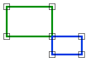
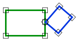

# Join

Espacio de nombres: [Digi21.DigiNG.Entities.Relations](../../)  
Ensamblado: [Digi21.DigiNG](../../../)

Indica si dos áreas tienen un punto en común.





## Sobrecargas

|  |  |
| :--- | :--- |
| [Join\(ReadOnlyLine, ReadOnlyLine\)](join.md#join-readonlyline-readonlyline) | Indica si las dos áreas de tipo [ReadOnlyLine](../../../digi21.diging.entities/readonlyline/) tienen un punto de unión. |
| [Join\(ReadOnlyLine, ReadOnlyPolygon\)](join.md#join-readonlyline-readonlypolygon) | Indica dos áreas de tipo [ReadOnlyLine](../../../digi21.diging.entities/readonlyline/) y [ReadOnlyPolygon](../../../digi21.diging.entities/readonlypolygon/) tienen un punto en común. |
| [Join\(ReadOnlyPolygon, ReadOnlyLine\)](join.md#join-readonlypolygon-readonlyline) | Indica dos áreas de tipo [ReadOnlyPolygon](../../../digi21.diging.entities/readonlypolygon/) y [ReadOnlyLine](../../../digi21.diging.entities/readonlyline/) tienen un punto en común. |
| [Join\(ReadOnlyPolygon, ReadOnlyPolygon\)](join.md#join-readonlypolygon-readonlypolygon) | Indica las dos áreas de tipo [ReadOnlyPolygon](../../../digi21.diging.entities/readonlypolygon/) tienen un punto en común. |

## Join\(ReadOnlyLine, ReadOnlyLine\)

Indica si las dos áreas de tipo [ReadOnlyLine](../../../digi21.diging.entities/readonlyline/) tienen un punto de unión.

```csharp
public static bool Join(ReadOnlyLine a, ReadOnlyLine b)
```

### Parámetros

`a` [ReadOnlyLine](../../../digi21.diging.entities/readonlyline/)  
Primera área.

`b` [ReadOnlyLine](../../../digi21.diging.entities/readonlyline/)  
Segunda área.

## Devuelve

[Boolean](https://docs.microsoft.com/en-us/dotnet/api/system.boolean?view=net-5.0)  
_Verdadero_ si las dos áreas tienen un punto de unión.

## Join\(ReadOnlyLine, ReadOnlyPolygon\)

Indica dos áreas de tipo [ReadOnlyLine](../../../digi21.diging.entities/readonlyline/) y [ReadOnlyPolygon](../../../digi21.diging.entities/readonlypolygon/) tienen un punto en común.

```csharp
public static bool Join(ReadOnlyLine a, ReadOnlyPolygon b)
```

### Parámetros

`a` [ReadOnlyLine](../../../digi21.diging.entities/readonlyline/)  
Primera área.

`b` [ReadOnlyPolygon](../../../digi21.diging.entities/readonlypolygon/)  
Segunda área.

## Devuelve

[Boolean](https://docs.microsoft.com/en-us/dotnet/api/system.boolean?view=net-5.0)  
_Verdadero_ si las dos áreas tienen un punto de unión.

## Join\(ReadOnlyPolygon, ReadOnlyLine\)

Indica dos áreas de tipo [ReadOnlyPolygon](../../../digi21.diging.entities/readonlypolygon/) y [ReadOnlyLine](../../../digi21.diging.entities/readonlyline/) tienen un punto en común.

```csharp
public static bool Join(ReadOnlyPolygon a, ReadOnlyLine b)
```

### Parámetros

`a` [ReadOnlyPolygon](../../../digi21.diging.entities/readonlypolygon/)  
Primera área.

`b` [ReadOnlyLine](../../../digi21.diging.entities/readonlyline/)  
Segunda área.

## Devuelve

[Boolean](https://docs.microsoft.com/en-us/dotnet/api/system.boolean?view=net-5.0)  
_Verdadero_ si las dos áreas tienen un punto de unión.

## Join\(ReadOnlyPolygon, ReadOnlyPolygon\)

Indica las dos áreas de tipo [ReadOnlyPolygon](../../../digi21.diging.entities/readonlypolygon/) tienen un punto en común.

```csharp
public static bool Join(ReadOnlyPolygon a, ReadOnlyPolygon b)
```

### Parámetros

`a` [ReadOnlyPolygon](../../../digi21.diging.entities/readonlypolygon/)  
Primera área.

`b` [ReadOnlyPolygon](../../../digi21.diging.entities/readonlypolygon/)  
Segunda área.

## Devuelve

[Boolean](https://docs.microsoft.com/en-us/dotnet/api/system.boolean?view=net-5.0)  
_Verdadero_ si las dos áreas tienen un punto de unión.


