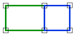

# OuterRingAdjacent

Espacio de nombres: [Digi21.DigiNG.Entities.Relations](../../)  
Ensamblado: [Digi21.DigiNG](../../../)

Indica si los límites exteriores de las áreas son adyacentes.



## Observaciones

Este método tiene en consideración únicamente el límite exterior de los [ReadOnlyPolygon](../../../digi21.diging.entities/readonlypolygon/), de manera que, si la otra área es adyacente a algún hueco, no se considerará.

## Sobrecargas

|  |  |
| :--- | :--- |
| [OuterRingAdjacent\(ReadOnlyLine, ReadOnlyPolygon\)](outerringadjacent.md#outerringadjacent-readonlyline-readonlypolygon) | Indica si el área [ReadOnlyLine](../../../digi21.diging.entities/readonlyline/) es adyacente al área representada por el límite exterior del [ReadOnlyPolygon](../../../digi21.diging.entities/readonlypolygon/). |
| [OuterRingAdjacent\(ReadOnlyPolygon, ReadOnlyLine\)](outerringadjacent.md#outerringadjacent-readonlypolygon-readonlyline) | Indica si el área [ReadOnlyLine](../../../digi21.diging.entities/readonlyline/) es adyacente al área representada por el límite exterior del [ReadOnlyPolygon](../../../digi21.diging.entities/readonlypolygon/). |
| [OuterRingAdjacent\(ReadOnlyPolygon, ReadOnlyPolygon\)](outerringadjacent.md#outerringadjacent-readonlypolygon-readonlypolygon) | Indica si el límite exterior de los dos  [ReadOnlyPolygon](../../../digi21.diging.entities/readonlypolygon/) son adyacentes. |

## OuterRingAdjacent\(ReadOnlyLine, ReadOnlyPolygon\)

Indica si el área [ReadOnlyLine](../../../digi21.diging.entities/readonlyline/) es adyacente al área representada por el límite exterior del [ReadOnlyPolygon](../../../digi21.diging.entities/readonlypolygon/).

```csharp
public static bool OuterRingAdjacent(ReadOnlyLine a, ReadOnlyPolygon b) 
```

### Parámetros

`a` [ReadOnlyLine](../../../digi21.diging.entities/readonlyline/)  
Primera área.

`b` [ReadOnlyPolygon](../../../digi21.diging.entities/readonlypolygon/)  
Segunda área.

## Devuelve

[Boolean](https://docs.microsoft.com/en-us/dotnet/api/system.boolean?view=net-5.0)  
_Verdadero_ si las dos áreas son adyacentes.

## OuterRingAdjacent\(ReadOnlyPolygon, ReadOnlyLine\)

Indica si el área [ReadOnlyLine](../../../digi21.diging.entities/readonlyline/) es adyacente al área representada por el límite exterior del [ReadOnlyPolygon](../../../digi21.diging.entities/readonlypolygon/).

```csharp
public static bool OuterRingAdjacent(ReadOnlyPolygon a, ReadOnlyLine b)
```

### Parámetros

`a` [ReadOnlyPolygon](../../../digi21.diging.entities/readonlypolygon/)  
Primera área.

`b` [ReadOnlyLine](../../../digi21.diging.entities/readonlyline/)  
Segunda área.

## Devuelve

[Boolean](https://docs.microsoft.com/en-us/dotnet/api/system.boolean?view=net-5.0)  
_Verdadero_ si las dos áreas son adyacentes.

## OuterRingAdjacent\(ReadOnlyPolygon, ReadOnlyPolygon\)

Indica si el límite exterior de los dos  [ReadOnlyPolygon](../../../digi21.diging.entities/readonlypolygon/) son adyacentes.

```csharp
public static bool OuterRingAdjacent(ReadOnlyPolygon a, ReadOnlyPolygon b)
```

### Parámetros

`a` [ReadOnlyPolygon](../../../digi21.diging.entities/readonlypolygon/)  
Primera área.

`b` [ReadOnlyPolygon](../../../digi21.diging.entities/readonlypolygon/)  
Segunda área.

## Devuelve

[Boolean](https://docs.microsoft.com/en-us/dotnet/api/system.boolean?view=net-5.0)  
_Verdadero_ si las dos áreas son adyacentes.

