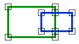
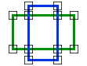

# Overlap

Espacio de nombres: [Digi21.DigiNG.Entities.Relations](../../)  
Ensamblado: [Digi21.DigiNG](../../../)

Indica si las dos áreas solapan.





## Sobrecargas

|  |  |
| :--- | :--- |
| [Overlap\(ReadOnlyLine, ReadOnlyLine, out Point3D\)](overlap.md#overlap-readonlyline-readonlyline-out-point-3-d) | Indica si las dos áreas de tipo [ReadOnlyLine](../../../digi21.diging.entities/readonlyline/) solapan y devuelve además las coordenadas de un punto por el que se cruzan. |
| [Overlap\(ReadOnlyLine, ReadOnlyPolygon, out Point3D\)](overlap.md#overlap-readonlyline-readonlypolygon-out-point-3-d) | Indica si el área de tipo [ReadOnlyLine](../../../digi21.diging.entities/readonlyline/) solapa con el área de tipo [ReadOnlyPolygon](../../../digi21.diging.entities/readonlypolygon/) y devuelve además las coordenadas de un punto por el que se cruzan. |
| [Overlap\(ReadOnlyPolygon, ReadOnlyLine, out Point3D\)](overlap.md#overlap-readonlypolygon-readonlyline-out-point-3-d) | Indica si el área de tipo [ReadOnlyPolygon](../../../digi21.diging.entities/readonlypolygon/) solapa con el área de tipo [ReadOnlyLine](../../../digi21.diging.entities/readonlyline/) y devuelve además las coordenadas de un punto por el que se cruzan. |
| [Overlap\(ReadOnlyPolygon, ReadOnlyPolygon, out Point3D\)](overlap.md#overlap-readonlypolygon-readonlypolygon-out-point-3-d) | Indica si las dos áreas de tipo [ReadOnlyPolygon](../../../digi21.diging.entities/readonlypolygon/) solapan y devuelve además las coordenadas de un punto por el que se cruzan. |

## Overlap\(ReadOnlyLine, ReadOnlyLine, out Point3D\)

Indica si las dos áreas de tipo [ReadOnlyLine](../../../digi21.diging.entities/readonlyline/) solapan y devuelve además las coordenadas de un punto por el que se cruzan.

```csharp
public static bool Overlap(ReadOnlyLine a, ReadOnlyLine b, out Point3D coordinate)
```

### Parámetros

`a` [ReadOnlyLine](../../../digi21.diging.entities/readonlyline/)  
Primera área.

`b` [ReadOnlyLine](../../../digi21.diging.entities/readonlyline/)  
Segunda área.

`coordinate` [Point3D](../../../digi21.math/point3d.md)  
Una coordenada en la que cortan los polígonos. Este parámetro se puede utilizar para mostrar un error al usuario en caso de que el solape sea un error.

## Devuelve

[Boolean](https://docs.microsoft.com/en-us/dotnet/api/system.boolean?view=net-5.0)  
_Verdadero_ si las dos áreas solapan.

## Overlap\(ReadOnlyLine, ReadOnlyPolygon, out Point3D\)

Indica si el área de tipo [ReadOnlyLine](../../../digi21.diging.entities/readonlyline/) solapa con el área de tipo [ReadOnlyPolygon](../../../digi21.diging.entities/readonlypolygon/) y devuelve además las coordenadas de un punto por el que se cruzan.

```csharp
public static bool Overlap(ReadOnlyLine a, ReadOnlyPolygon b, out Point3D coordinate)
```

### Parámetros

`a` [ReadOnlyLine](../../../digi21.diging.entities/readonlyline/)  
Primera área.

`b` [ReadOnlyPolygon](../../../digi21.diging.entities/readonlypolygon/)  
Segunda área.

`coordinate` [Point3D](../../../digi21.math/point3d.md)  
Una coordenada en la que cortan los polígonos. Este parámetro se puede utilizar para mostrar un error al usuario en caso de que el solape sea un error.

## Devuelve

[Boolean](https://docs.microsoft.com/en-us/dotnet/api/system.boolean?view=net-5.0)  
_Verdadero_ si las dos áreas solapan.

## Overlap\(ReadOnlyPolygon, ReadOnlyLine, out Point3D\)

Indica si el área de tipo [ReadOnlyPolygon](../../../digi21.diging.entities/readonlypolygon/) solapa con el área de tipo [ReadOnlyLine](../../../digi21.diging.entities/readonlyline/) y devuelve además las coordenadas de un punto por el que se cruzan.

```csharp
public static bool Overlap(ReadOnlyPolygon a, ReadOnlyLine b, out Point3D coordinate)
```

### Parámetros

`a` [ReadOnlyPolygon](../../../digi21.diging.entities/readonlypolygon/)  
Primera área.

`b` [ReadOnlyLine](../../../digi21.diging.entities/readonlyline/)  
Segunda área.

`coordinate` [Point3D](../../../digi21.math/point3d.md)  
Una coordenada en la que cortan los polígonos. Este parámetro se puede utilizar para mostrar un error al usuario en caso de que el solape sea un error.

## Devuelve

[Boolean](https://docs.microsoft.com/en-us/dotnet/api/system.boolean?view=net-5.0)  
_Verdadero_ si las dos áreas solapan.

## Overlap\(ReadOnlyPolygon, ReadOnlyPolygon, out Point3D\)

Indica si las dos áreas de tipo [ReadOnlyPolygon](../../../digi21.diging.entities/readonlypolygon/) solapan y devuelve además las coordenadas de un punto por el que se cruzan.

```csharp
public static bool Overlap(ReadOnlyPolygon a, ReadOnlyPolygon b, out Point3D coordinate)
```

### Parámetros

`a` [ReadOnlyPolygon](../../../digi21.diging.entities/readonlypolygon/)  
Primera área.

`b` [ReadOnlyPolygon](../../../digi21.diging.entities/readonlypolygon/)  
Segunda área.

`coordinate` [Point3D](../../../digi21.math/point3d.md)  
Una coordenada en la que cortan los polígonos. Este parámetro se puede utilizar para mostrar un error al usuario en caso de que el solape sea un error.

## Devuelve

[Boolean](https://docs.microsoft.com/en-us/dotnet/api/system.boolean?view=net-5.0)  
_Verdadero_ si las dos áreas solapan.


