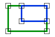
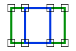

# Within

Espacio de nombres: [Digi21.DigiNG.Entities.Relations](../../)  
Ensamblado: [Digi21.DigiNG](../../../)

Indica si la primera área está en el interior de la segunda área.





## Sobrecargas

|  |  |
| :--- | :--- |
| [Within\(ReadOnlyLine, ReadOnlyLine\)](within.md#within-readonlyline-readonlyline) | Indica si la primera área de tipo [ReadOnlyLine](../../../digi21.diging.entities/readonlyline/) está incluida en la segunda área de tipo [ReadOnlyLine](../../../digi21.diging.entities/readonlyline/). |
| [Within\(ReadOnlyLine, ReadOnlyPolygon\)](within.md#within-readonlyline-readonlypolygon) | Indica si la primera área de tipo [ReadOnlyLine](../../../digi21.diging.entities/readonlyline/) está incluida en la segunda área de tipo [ReadOnlyPolygon](../../../digi21.diging.entities/readonlypolygon/). |
| [Within\(ReadOnlyPolygon, ReadOnlyLine\)](within.md#within-readonlypolygon-readonlyline) | Indica si la primera área de tipo [ReadOnlyPolygon](../../../digi21.diging.entities/readonlypolygon/) está incluida en la segunda área de tipo [ReadOnlyLine](../../../digi21.diging.entities/readonlyline/). |
| [Within\(ReadOnlyPolygon, ReadOnlyPolygon\)](within.md#within-readonlypolygon-readonlypolygon) | Indica si la primera área de tipo [ReadOnlyPolygon](../../../digi21.diging.entities/readonlypolygon/) está incluida en la segunda área de tipo [ReadOnlyPolygon](../../../digi21.diging.entities/readonlypolygon/). |

## Within\(ReadOnlyLine, ReadOnlyLine\)

Indica si la primera área de tipo [ReadOnlyLine](../../../digi21.diging.entities/readonlyline/) está incluida en la segunda área de tipo [ReadOnlyLine](../../../digi21.diging.entities/readonlyline/).

```csharp
public static bool Within(ReadOnlyLine a, ReadOnlyLine b)
```

### Parámetros

`a` [ReadOnlyLine](../../../digi21.diging.entities/readonlyline/)  
Primera área.

`b` [ReadOnlyLine](../../../digi21.diging.entities/readonlyline/)  
Segunda área.

## Devuelve

[Boolean](https://docs.microsoft.com/en-us/dotnet/api/system.boolean?view=net-5.0)  
_Verdadero_ si la primera área está incluida en la segunda área.

## Within\(ReadOnlyLine, ReadOnlyPolygon\)

Indica si la primera área de tipo [ReadOnlyLine](../../../digi21.diging.entities/readonlyline/) está incluida en la segunda área de tipo [ReadOnlyPolygon](../../../digi21.diging.entities/readonlypolygon/).

```csharp
public static bool Within(ReadOnlyLine a, ReadOnlyPolygon b)
```

### Parámetros

`a` [ReadOnlyLine](../../../digi21.diging.entities/readonlyline/)  
Primera área.

`b` [ReadOnlyPolygon](../../../digi21.diging.entities/readonlypolygon/)  
Segunda área.

## Devuelve

[Boolean](https://docs.microsoft.com/en-us/dotnet/api/system.boolean?view=net-5.0)  
Verdadero si la primera área está incluida en la segunda área.

## Within\(ReadOnlyPolygon, ReadOnlyLine\)

Indica si la primera área de tipo [ReadOnlyPolygon](../../../digi21.diging.entities/readonlypolygon/) está incluida en la segunda área de tipo [ReadOnlyLine](../../../digi21.diging.entities/readonlyline/).

```csharp
public static bool Within(ReadOnlyPolygon a, ReadOnlyLine b)
```

### Parámetros

`a` [ReadOnlyPolygon](../../../digi21.diging.entities/readonlypolygon/)  
Primera área.

`b` [ReadOnlyLine](../../../digi21.diging.entities/readonlyline/)  
Segunda área.

## Devuelve

[Boolean](https://docs.microsoft.com/en-us/dotnet/api/system.boolean?view=net-5.0)  
_Verdadero_ si la primera área está incluida en la segunda área.

## Within\(ReadOnlyPolygon, ReadOnlyPolygon\)

Indica si la primera área de tipo [ReadOnlyPolygon](../../../digi21.diging.entities/readonlypolygon/) está incluida en la segunda área de tipo [ReadOnlyPolygon](../../../digi21.diging.entities/readonlypolygon/).

```csharp
public static bool Within(ReadOnlyPolygon a, ReadOnlyPolygon b)
```

### Parámetros

`a` [ReadOnlyPolygon](../../../digi21.diging.entities/readonlypolygon/)  
Primera área.

`b` [ReadOnlyPolygon](../../../digi21.diging.entities/readonlypolygon/)  
Segunda área.

## Devuelve

[Boolean](https://docs.microsoft.com/en-us/dotnet/api/system.boolean?view=net-5.0)  
_Verdadero_ si la primera área está incluida en la segunda área.

