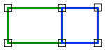

# Adjacent

Espacio de nombres: [Digi21.DigiNG.Entities.Relations](/digi3d-net/programacion/.net/referencia/digi21.diging/digi21.diging.entities.relations/)\
Ensamblado: [Digi21.DigiNG](/digi3d-net/programacion/.net/referencia/digi21.diging.plugin/digi21.diging/)

Indica si dos áreas son adyacentes.



## Sobrecargas

|                                                                                                    |                                                                                                                                                                                                     |
| -------------------------------------------------------------------------------------------------- | --------------------------------------------------------------------------------------------------------------------------------------------------------------------------------------------------- |
| [Adjacent(ReadOnlyLine, ReadOnlyLine)](adjacent.md#adjacent-readonlyline-readonlyline)             | Indica si dos areas de tipo [ReadOnlyLine](../../../../digi21.diging.entities/clases/readonlyline/)son adyacentes.                                                                                 |
| [Adjacent(ReadOnlyLine, ReadOnlyPolygon)](adjacent.md#adjacent-readonlyline-readonlypolygon)       | Indica si dos áreas de tipo [ReadOnlyLine](/digi3d-net/programacion/.net/referencia/digi21.diging/digi21.diging.entities/clases/readonlyline/) son adyacentes. |
| [Adjacent(ReadOnlyPolygon, ReadOnlyLine)](adjacent.md#adjacent-readonlypolygon-readonlyline)       | Indica si dos áreas de tipo [ReadOnlyPolygon](/digi3d-net/programacion/.net/referencia/digi21.diging/digi21.diging.entities/clases/readonlypolygon/) son adyacentes. |
| [Adjacent(ReadOnlyPolygon, ReadOnlyPolygon)](adjacent.md#adjacent-readonlypolygon-readonlypolygon) | Indica si dos áreas de tipo [ReadOnlyPolygon](/digi3d-net/programacion/.net/referencia/digi21.diging/digi21.diging.entities/clases/readonlypolygon/) son adyacentes.                                                                           |

## Adjacent(ReadOnlyLine, ReadOnlyLine)

Indica si dos areas de tipo [ReadOnlyLine](../../../../digi21.diging.entities/clases/readonlyline/)son adyacentes.

```csharp
public static bool Adjacent(ReadOnlyLine a, ReadOnlyLine b)
```

### Parámetros

`a` [ReadOnlyLine](/digi3d-net/programacion/.net/referencia/digi21.diging/digi21.diging.entities/clases/readonlyline/)\
Primera área.

`b` [ReadOnlyLine](/digi3d-net/programacion/.net/referencia/digi21.diging/digi21.diging.entities/clases/readonlyline/)\
Segunda área.

## Devuelve

[Boolean](https://docs.microsoft.com/en-us/dotnet/api/system.boolean?view=net-5.0)\
_Verdadero_ si las dos áreas son adyacentes.

## Adjacent(ReadOnlyLine, ReadOnlyPolygon)

Indica si dos áreas de tipo [ReadOnlyLine](/digi3d-net/programacion/.net/referencia/digi21.diging/digi21.diging.entities/clases/readonlyline/) son adyacentes.

```csharp
public static bool Adjacent(ReadOnlyLine a, ReadOnlyPolygon b)
```

### Parámetros

`a` [ReadOnlyLine](/digi3d-net/programacion/.net/referencia/digi21.diging/digi21.diging.entities/clases/readonlyline/)\
Primera área.

`b` [ReadOnlyPolygon](/digi3d-net/programacion/.net/referencia/digi21.diging/digi21.diging.entities/clases/readonlypolygon/)\
Segunda área.

## Devuelve

[Boolean](https://docs.microsoft.com/en-us/dotnet/api/system.boolean?view=net-5.0)\
_Verdadero_ si las dos áreas son adyacentes.

## Adjacent(ReadOnlyPolygon, ReadOnlyLine)

Indica si dos áreas de tipo [ReadOnlyPolygon](/digi3d-net/programacion/.net/referencia/digi21.diging/digi21.diging.entities/clases/readonlypolygon/) son adyacentes.

```csharp
public static bool Adjacent(ReadOnlyPolygon a, ReadOnlyLine b)
```

### Parámetros

`a` [ReadOnlyPolygon](/digi3d-net/programacion/.net/referencia/digi21.diging/digi21.diging.entities/clases/readonlypolygon/)\
Primera área.

`b` [ReadOnlyLine](/digi3d-net/programacion/.net/referencia/digi21.diging/digi21.diging.entities/clases/readonlyline/)\
Segunda área.

## Devuelve

[Boolean](https://docs.microsoft.com/en-us/dotnet/api/system.boolean?view=net-5.0)\
_Verdadero_ si las dos áreas son adyacentes.

## Adjacent(ReadOnlyPolygon, ReadOnlyPolygon)

Indica si dos áreas de tipo [ReadOnlyPolygon](/digi3d-net/programacion/.net/referencia/digi21.diging/digi21.diging.entities/clases/readonlypolygon/) son adyacentes.

```csharp
public static bool Adjacent(ReadOnlyPolygon a, ReadOnlyPolygon b)
```

### Parámetros

`a` [ReadOnlyPolygon](/digi3d-net/programacion/.net/referencia/digi21.diging/digi21.diging.entities/clases/readonlypolygon/)\
Primera área.

`b` [ReadOnlyPolygon](/digi3d-net/programacion/.net/referencia/digi21.diging/digi21.diging.entities/clases/readonlypolygon/)\
Segunda área.

## Devuelve

[Boolean](https://docs.microsoft.com/en-us/dotnet/api/system.boolean?view=net-5.0)\
_Verdadero_ si las dos áreas son adyacentes.
