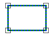

# Equal

Espacio de nombres: [Digi21.DigiNG.Entities.Relations](/digi3d-net/programacion/.net/referencia/digi21.diging/digi21.diging.entities.relations/)\
Ensamblado: [Digi21.DigiNG](/digi3d-net/programacion/.net/referencia/digi21.diging.plugin/digi21.diging/)

Indica si dos áreas son iguales.



## Sobrecargas

|                                                                                           |                                                                                                                                                                                               |
| ----------------------------------------------------------------------------------------- | --------------------------------------------------------------------------------------------------------------------------------------------------------------------------------------------- |
| [Equal(ReadOnlyLine, ReadOnlyLine)](equal.md#equal-readonlyline-readonlyline)             | Indica si las dos áreas de tipo [ReadOnlyLine](/digi3d-net/programacion/.net/referencia/digi21.diging/digi21.diging.entities/clases/readonlyline/) son iguales.                                                                          |
| [Equal(ReadOnlyLine, ReadOnlyPolygon)](equal.md#equal-readonlyline-readonlypolygon)       | Indica dos áreas de tipo [ReadOnlyLine](/digi3d-net/programacion/.net/referencia/digi21.diging/digi21.diging.entities/clases/readonlyline/) son iguales. |
| [Equal(ReadOnlyPolygon, ReadOnlyLine)](equal.md#equal-readonlypolygon-readonlyline)       | Indica dos áreas de tipo [ReadOnlyPolygon](/digi3d-net/programacion/.net/referencia/digi21.diging/digi21.diging.entities/clases/readonlypolygon/) son iguales. |
| [Equal(ReadOnlyPolygon, ReadOnlyPolygon)](equal.md#equal-readonlypolygon-readonlypolygon) | Indica las dos áreas de tipo [ReadOnlyPolygon](/digi3d-net/programacion/.net/referencia/digi21.diging/digi21.diging.entities/clases/readonlypolygon/) son iguales.                                                                       |

## Equal(ReadOnlyLine, ReadOnlyLine)

Indica si las dos áreas de tipo [ReadOnlyLine](/digi3d-net/programacion/.net/referencia/digi21.diging/digi21.diging.entities/clases/readonlyline/) son iguales.

```csharp
public static bool Equal(ReadOnlyLine a, ReadOnlyLine b)
```

### Parámetros

`a` [ReadOnlyLine](/digi3d-net/programacion/.net/referencia/digi21.diging/digi21.diging.entities/clases/readonlyline/)\
Primera área.

`b` [ReadOnlyLine](/digi3d-net/programacion/.net/referencia/digi21.diging/digi21.diging.entities/clases/readonlyline/)\
Segunda área.

## Devuelve

[Boolean](https://docs.microsoft.com/en-us/dotnet/api/system.boolean?view=net-5.0)\
_Verdadero_ si las dos áreas son iguales.

## Equal(ReadOnlyLine, ReadOnlyPolygon)

Indica dos áreas de tipo [ReadOnlyLine](/digi3d-net/programacion/.net/referencia/digi21.diging/digi21.diging.entities/clases/readonlyline/) son iguales.

```csharp
public static bool Equal(ReadOnlyLine a, ReadOnlyPolygon b)
```

### Parámetros

`a` [ReadOnlyLine](/digi3d-net/programacion/.net/referencia/digi21.diging/digi21.diging.entities/clases/readonlyline/)\
Primera área.

`b` [ReadOnlyPolygon](/digi3d-net/programacion/.net/referencia/digi21.diging/digi21.diging.entities/clases/readonlypolygon/)\
Segunda área.

## Devuelve

[Boolean](https://docs.microsoft.com/en-us/dotnet/api/system.boolean?view=net-5.0)\
_Verdadero_ si las dos áreas son iguales.

## Equal(ReadOnlyPolygon, ReadOnlyLine)

Indica dos áreas de tipo [ReadOnlyPolygon](/digi3d-net/programacion/.net/referencia/digi21.diging/digi21.diging.entities/clases/readonlypolygon/) son iguales.

```csharp
public static bool Equal(ReadOnlyPolygon a, ReadOnlyLine b)
```

### Parámetros

`a` [ReadOnlyPolygon](/digi3d-net/programacion/.net/referencia/digi21.diging/digi21.diging.entities/clases/readonlypolygon/)\
Primera área.

`b` [ReadOnlyLine](/digi3d-net/programacion/.net/referencia/digi21.diging/digi21.diging.entities/clases/readonlyline/)\
Segunda área.

## Devuelve

[Boolean](https://docs.microsoft.com/en-us/dotnet/api/system.boolean?view=net-5.0)\
_Verdadero_ si las dos áreas son iguales.

## Equal(ReadOnlyPolygon, ReadOnlyPolygon)

Indica las dos áreas de tipo [ReadOnlyPolygon](/digi3d-net/programacion/.net/referencia/digi21.diging/digi21.diging.entities/clases/readonlypolygon/) son iguales.

```csharp
public static bool Equal(ReadOnlyPolygon a, ReadOnlyPolygon b)
```

### Parámetros

`a` [ReadOnlyPolygon](/digi3d-net/programacion/.net/referencia/digi21.diging/digi21.diging.entities/clases/readonlypolygon/)\
Primera área.

`b` [ReadOnlyPolygon](/digi3d-net/programacion/.net/referencia/digi21.diging/digi21.diging.entities/clases/readonlypolygon/)\
Segunda área.

## Devuelve

[Boolean](https://docs.microsoft.com/en-us/dotnet/api/system.boolean?view=net-5.0)\
_Verdadero_ si las dos áreas son iguales.
