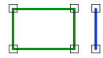

# Disjoint

Espacio de nombres: [Digi21.DigiNG.Entities.Relations](/digi3d-net/programacion/.net/referencia/digi21.diging/digi21.diging.entities.relations/)\
Ensamblado: [Digi21.DigiNG](/digi3d-net/programacion/.net/referencia/digi21.diging.plugin/digi21.diging/)

Indica si la línea es disjunta al área.



### Sobrecargas

|                                                                                              |                                                                                                                                |
| -------------------------------------------------------------------------------------------- | ------------------------------------------------------------------------------------------------------------------------------ |
| [Disjoint(ReadOnlyLine, ReadOnlyLine)](disjoint.md#disjoint-readonlyline-readonlyline)       | Indica si la línea es disjunta al área de tipo [ReadOnlyLine](/digi3d-net/programacion/.net/referencia/digi21.diging/digi21.diging.entities/clases/readonlyline/).        |
| [Disjoint(ReadOnlyLine, ReadOnlyPolygon)](disjoint.md#disjoint-readonlyline-readonlypolygon) | Indica si la línea es adyacente al área de tipo [ReadOnlyPolygon](/digi3d-net/programacion/.net/referencia/digi21.diging/digi21.diging.entities/clases/readonlypolygon/). |

## Disjoint(ReadOnlyLine, ReadOnlyLine)

Indica si la línea es disjunta al área de tipo [ReadOnlyLine](/digi3d-net/programacion/.net/referencia/digi21.diging/digi21.diging.entities/clases/readonlyline/).

```csharp
public static bool Disjoint(ReadOnlyLine line, ReadOnlyLine area)
```

### Parámetros

`line` [ReadOnlyLine](/digi3d-net/programacion/.net/referencia/digi21.diging/digi21.diging.entities/clases/readonlyline/)\
Línea.

`area` [ReadOnlyLine](/digi3d-net/programacion/.net/referencia/digi21.diging/digi21.diging.entities/clases/readonlyline/)\
Área.

## Devuelve

[Boolean](https://docs.microsoft.com/en-us/dotnet/api/system.boolean?view=net-5.0)\
_Verdadero_ si la línea es y el área son disjuntas.

## Disjoint(ReadOnlyLine, ReadOnlyPolygon)

Indica si la línea es adyacente al área de tipo [ReadOnlyPolygon](/digi3d-net/programacion/.net/referencia/digi21.diging/digi21.diging.entities/clases/readonlypolygon/).

```csharp
public static bool Disjoint(ReadOnlyLine line, ReadOnlyPolygon area) 
```

### Parámetros

`line` [ReadOnlyLine](/digi3d-net/programacion/.net/referencia/digi21.diging/digi21.diging.entities/clases/readonlyline/)\
Línea.

`area` [ReadOnlyPolygon](/digi3d-net/programacion/.net/referencia/digi21.diging/digi21.diging.entities/clases/readonlypolygon/)\
Área.

## Devuelve

[Boolean](https://docs.microsoft.com/en-us/dotnet/api/system.boolean?view=net-5.0)\
_Verdadero_ si la línea es y el área son disjuntas.
