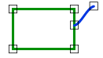

# EndpointJoin

Espacio de nombres: [Digi21.DigiNG.Entities.Relations](../../../)\
Ensamblado: [Digi21.DigiNG](../../../../)

Indica si uno de los extremos se la línea se junta con el área.



## Sobrecargas

|                                                                                                          |                                                                                                                                                      |
| -------------------------------------------------------------------------------------------------------- | ---------------------------------------------------------------------------------------------------------------------------------------------------- |
| [EndpointJoin(ReadOnlyLine, ReadOnlyLine)](endpointjoin.md#endpointjoin-readonlyline-readonlyline)       | Indica si uno de los extremos de la línea finaliza en el área de tipo [ReadOnlyLine](../../../../digi21.diging.entities/clases/readonlyline/).       |
| [EndpointJoin(ReadOnlyLine, ReadOnlyPolygon)](endpointjoin.md#endpointjoin-readonlyline-readonlypolygon) | Indica si uno de los extremos de la línea finaliza en el área de tipo [ReadOnlyPolygon](../../../../digi21.diging.entities/clases/readonlypolygon/). |

## EndpointJoin(ReadOnlyLine, ReadOnlyLine)

Indica si uno de los extremos de la línea finaliza en el área de tipo [ReadOnlyLine](../../../../digi21.diging.entities/clases/readonlyline/).

```csharp
public static bool EndpointJoin(ReadOnlyLine line, ReadOnlyLine area)
```

### Parámetros

`line` [ReadOnlyLine](../../../../digi21.diging.entities/clases/readonlyline/)\
Línea.

`area` [ReadOnlyLine](../../../../digi21.diging.entities/clases/readonlyline/)\
Área.

## Devuelve

[Boolean](https://docs.microsoft.com/en-us/dotnet/api/system.boolean?view=net-5.0)\
_Verdadero_ si uno de los extremos de la línea se junta con el área.

## EndpointJoin(ReadOnlyLine, ReadOnlyPolygon)

Indica si uno de los extremos de la línea finaliza en el área de tipo [ReadOnlyPolygon](../../../../digi21.diging.entities/clases/readonlypolygon/).

```csharp
public static bool EndpointJoin(ReadOnlyLine line, ReadOnlyPolygon area)
```

### Parámetros

`line` [ReadOnlyLine](../../../../digi21.diging.entities/clases/readonlyline/)\
Línea.

`area` [ReadOnlyPolygon](../../../../digi21.diging.entities/clases/readonlypolygon/)\
Área.

## Devuelve

[Boolean](https://docs.microsoft.com/en-us/dotnet/api/system.boolean?view=net-5.0)\
_Verdadero_ si uno de los extremos de la línea se junta con el área.
