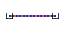

# Equal

Espacio de nombres: [Digi21.DigiNG.Entities.Relations](../../../)  
Ensamblado: [Digi21.DigiNG](../../../../)

Indica si las dos [ReadOnlyLine](../../../../digi21.diging.entities/clases/readonlyline/) son iguales.



```csharp
public static bool Equal(ReadOnlyLine a, ReadOnlyLine b)
```

### Parámetros

`a` [ReadOnlyLine](../../../../digi21.diging.entities/clases/readonlyline/)  
Primera línea.

`b` [ReadOnlyPolygon](../../../../digi21.diging.entities/clases/readonlypolygon/)  
Segunda línea.

## Devuelve

[Boolean](https://docs.microsoft.com/en-us/dotnet/api/system.boolean?view=net-5.0)  
_Verdadero_ si las dos líneas son iguales.

