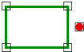

# Disjoint

Espacio de nombres: [Digi21.DigiNG.Entities.Relations](../../../)  
Ensamblado: [Digi21.DigiNG](../../../../)

Indica si el punto y el área son disjuntos.



## Sobrecargas

|  |  |
| :--- | :--- |
| [Disjoint\(ReadOnlyPoint, ReadOnlyLine\)](disjoint.md#disjoint-readonlypoint-readonlyline) | Indica si el [ReadOnlyPoint](../../../../digi21.diging.entities/clases/readonlypoint/) y el área de tipo [ReadOnlyLine](../../../../digi21.diging.entities/clases/readonlyline/) son disjuntos. |
| [Disjoint\(ReadOnlyPoint, ReadOnlyPolygon\)](disjoint.md#disjoint-readonlypoint-readonlypolygon) | Indica si el [ReadOnlyPoint](../../../../digi21.diging.entities/clases/readonlypoint/) y el área de tipo [ReadOnlyPolygon](../../../../digi21.diging.entities/clases/readonlypolygon/) son disjuntos. |

## Disjoint\(ReadOnlyPoint, ReadOnlyLine\)

Indica si el [ReadOnlyPoint](../../../../digi21.diging.entities/clases/readonlypoint/) y el área de tipo [ReadOnlyLine](../../../../digi21.diging.entities/clases/readonlyline/) son disjuntos.

```csharp
public static bool Disjoint(ReadOnlyPoint point, ReadOnlyLine area)
```

### Parámetros

`point` [ReadOnlyPoint](../../../../digi21.diging.entities/clases/readonlypoint/)  
Punto.

`area` [ReadOnlyLine](../../../../digi21.diging.entities/clases/readonlyline/)  
Area.

## Devuelve

[Boolean](https://docs.microsoft.com/en-us/dotnet/api/system.boolean?view=net-5.0)  
_Verdadero_ si el punto y la línea son disjuntos.

## Disjoint\(ReadOnlyPoint, ReadOnlyPolygon\)

Indica si el [ReadOnlyPoint](../../../../digi21.diging.entities/clases/readonlypoint/) y el área de tipo [ReadOnlyPolygon](../../../../digi21.diging.entities/clases/readonlypolygon/) son disjuntos.

```csharp
public static bool Disjoint(ReadOnlyPoint point, ReadOnlyPolygon area)
```

### Parámetros

`point` [ReadOnlyPoint](../../../../digi21.diging.entities/clases/readonlypoint/)  
Punto.

`area` [ReadOnlyPolygon](../../../../digi21.diging.entities/clases/readonlypolygon/)  
Area.

## Devuelve

[Boolean](https://docs.microsoft.com/en-us/dotnet/api/system.boolean?view=net-5.0)  
_Verdadero_ si el punto y la línea son disjuntos.

