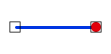

# CoincidentAndTerminate

Espacio de nombres: [Digi21.DigiNG.Entities.Relations](../../../)  
Ensamblado: [Digi21.DigiNG](../../../../)

Indica si el [ReadOnlyPoint](../../../../digi21.diging.entities/clases/readonlypoint/) es coincidente con uno de los extremos del [ReadOnlyLine](../../../../digi21.diging.entities/clases/readonlyline/).



```csharp
public static bool CoincidentAndTerminate(ReadOnlyPoint point, ReadOnlyLine line)
```

### Parámetros

`point` [ReadOnlyPoint](../../../../digi21.diging.entities/clases/readonlypoint/)  
Punto.

`line` [ReadOnlyLine](../../../../digi21.diging.entities/clases/readonlyline/)  
Línea.

## Devuelve

[Boolean](https://docs.microsoft.com/en-us/dotnet/api/system.boolean?view=net-5.0)  
_Verdadero_ si el punto es coincidente con alguno de los extremos de la línea.

