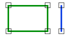

# Disjoint

Espacio de nombres: [Digi21.DigiNG.Entities.Relations](../../)  
Ensamblado: [Digi21.DigiNG](../../../)

Indica si la línea es disjunta al área.



### Sobrecargas

|  |  |
| :--- | :--- |
| [Disjoint\(ReadOnlyLine, ReadOnlyLine\)](disjoint.md#disjoint-readonlyline-readonlyline) | Indica si la línea es disjunta al área de tipo [ReadOnlyLine](../../../digi21.diging.entities/readonlyline/). |
| [Disjoint\(ReadOnlyLine, ReadOnlyPolygon\)](disjoint.md#disjoint-readonlyline-readonlypolygon) | Indica si la línea es adyacente al área de tipo [ReadOnlyPolygon](../../../digi21.diging.entities/readonlypolygon/). |

## Disjoint\(ReadOnlyLine, ReadOnlyLine\)

Indica si la línea es disjunta al área de tipo [ReadOnlyLine](../../../digi21.diging.entities/readonlyline/).

```csharp
public static bool Disjoint(ReadOnlyLine line, ReadOnlyLine area)
```

### Parámetros

`line` [ReadOnlyLine](../../../digi21.diging.entities/readonlyline/)  
Línea.

`area` [ReadOnlyLine](../../../digi21.diging.entities/readonlyline/)  
Área.

## Devuelve

[Boolean](https://docs.microsoft.com/en-us/dotnet/api/system.boolean?view=net-5.0)  
_Verdadero_ si la línea es y el área son disjuntas.

## Disjoint\(ReadOnlyLine, ReadOnlyPolygon\)

Indica si la línea es adyacente al área de tipo [ReadOnlyPolygon](../../../digi21.diging.entities/readonlypolygon/).

```csharp
public static bool Disjoint(ReadOnlyLine line, ReadOnlyPolygon area) 
```

### Parámetros

`line` [ReadOnlyLine](../../../digi21.diging.entities/readonlyline/)  
Línea.

`area` [ReadOnlyPolygon](../../../digi21.diging.entities/readonlypolygon/)  
Área.

## Devuelve

[Boolean](https://docs.microsoft.com/en-us/dotnet/api/system.boolean?view=net-5.0)  
_Verdadero_ si la línea es y el área son disjuntas.

