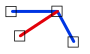

# EndpointJoinExcludingEndpoints

Espacio de nombres: [Digi21.DigiNG.Entities.Relations](/digi3d-net/programacion/.net/referencia/digi21.diging/digi21.diging.entities.relations/)  
Ensamblado: [Digi21.DigiNG](/digi3d-net/programacion/.net/referencia/digi21.diging.plugin/digi21.diging/)

Indica uno de los extremos de la primera [ReadOnlyLine](/digi3d-net/programacion/.net/referencia/digi21.diging/digi21.diging.entities/clases/readonlyline/).



```csharp
public static bool EndpointJoinExcludingEndpoints(ReadOnlyLine a, ReadOnlyLine b)
```

### Parámetros

`a` [ReadOnlyLine](/digi3d-net/programacion/.net/referencia/digi21.diging/digi21.diging.entities/clases/readonlyline/)  
Primera línea.

`b` [ReadOnlyPolygon](/digi3d-net/programacion/.net/referencia/digi21.diging/digi21.diging.entities/clases/readonlypolygon/)  
Segunda línea.

## Devuelve

[Boolean](https://docs.microsoft.com/en-us/dotnet/api/system.boolean?view=net-5.0)  
_Verdadero_ si uno de los extremos de la primera línea se une a la segunda línea \(excepto por los extremos de la segunda línea\).

