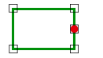

# Coincident

Espacio de nombres: [Digi21.DigiNG.Entities.Relations](../../)  
Ensamblado: [Digi21.DigiNG](../../../)

Indica si el punto y el área son coincidentes.



## Sobrecargas

|  |  |
| :--- | :--- |
| [Coincident\(ReadOnlyPoint, ReadOnlyLine\)](coincident.md#coincident-readonlypoint-readonlyline) | Indica si el [ReadOnlyPoint ](../../../digi21.diging.entities/readonlypoint/)es coincidente con el área de tipo [ReadOnlyLine](../../../digi21.diging.entities/readonlyline/). |
| [Coincident\(ReadOnlyPoint, ReadOnlyPolygon\)](coincident.md#coincident-readonlypoint-readonlypolygon) | Indica si el [ReadOnlyPoint ](../../../digi21.diging.entities/readonlypoint/)es coincidente con el área de tipo [ReadOnlyPolygon](../../../digi21.diging.entities/readonlypolygon/). |

## Coincident\(ReadOnlyPoint, ReadOnlyLine\)

Indica si el [ReadOnlyPoint ](../../../digi21.diging.entities/readonlypoint/)es coincidente con el área de tipo [ReadOnlyLine](../../../digi21.diging.entities/readonlyline/).

```csharp
public static bool Coincident(ReadOnlyPoint point, ReadOnlyLine area)
```

### Parámetros

`point` [ReadOnlyPoint](../../../digi21.diging.entities/readonlypoint/)  
Punto.

`area` [ReadOnlyLine](../../../digi21.diging.entities/readonlyline/)  
Area.

## Devuelve

[Boolean](https://docs.microsoft.com/en-us/dotnet/api/system.boolean?view=net-5.0)  
_Verdadero_ si el punto y la línea son coincidentes.

## Coincident\(ReadOnlyPoint, ReadOnlyPolygon\)

Indica si el [ReadOnlyPoint ](../../../digi21.diging.entities/readonlypoint/)es coincidente con el área de tipo [ReadOnlyPolygon](../../../digi21.diging.entities/readonlypolygon/).

```csharp
public static bool Coincident(ReadOnlyPoint point, ReadOnlyPolygon area)
```

### Parámetros

`point` [ReadOnlyPoint](../../../digi21.diging.entities/readonlypoint/)  
Punto.

`area` [ReadOnlyPolygon](../../../digi21.diging.entities/readonlypolygon/)  
Area.

## Devuelve

[Boolean](https://docs.microsoft.com/en-us/dotnet/api/system.boolean?view=net-5.0)  
_Verdadero_ si el punto y la línea son coincidentes.

