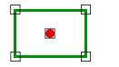

# Within

Espacio de nombres: [Digi21.DigiNG.Entities.Relations](../../)  
Ensamblado: [Digi21.DigiNG](../../../)

Indica si el punto está en el interior del área.



## Sobrecargas

|  |  |
| :--- | :--- |
| Within\(ReadOnlyPoint, ReadOnlyLine\) | Indica si el [ReadOnlyPoint](../../../digi21.diging.entities/readonlypoint/) está en el interior del área de tipo [ReadOnlyLine](../../../digi21.diging.entities/readonlyline/). |
| Within\(ReadOnlyPoint, ReadOnlyPolygon\) | Indica si el [ReadOnlyPoint](../../../digi21.diging.entities/readonlypoint/) está en el interior del área de tipo [ReadOnlyPolygon](../../../digi21.diging.entities/readonlypolygon/). |

## Within\(ReadOnlyPoint, ReadOnlyLine\)

Indica si el [ReadOnlyPoint](../../../digi21.diging.entities/readonlypoint/) está en el interior del área de tipo [ReadOnlyLine](../../../digi21.diging.entities/readonlyline/).

```csharp
public static bool Within(ReadOnlyPoint point, ReadOnlyLine area)
```

### Parámetros

`point` [ReadOnlyPoint](../../../digi21.diging.entities/readonlypoint/)  
Punto.

`area` [ReadOnlyLine](../../../digi21.diging.entities/readonlyline/)  
Area.

## Devuelve

[Boolean](https://docs.microsoft.com/en-us/dotnet/api/system.boolean?view=net-5.0)  
_Verdadero_ si el punto está en el interior del área.

## Within\(ReadOnlyPoint, ReadOnlyPolygon\)

Indica si el [ReadOnlyPoint](../../../digi21.diging.entities/readonlypoint/) está en el interior del área de tipo [ReadOnlyPolygon](../../../digi21.diging.entities/readonlypolygon/).

```csharp
 public static bool Within(ReadOnlyPoint point, ReadOnlyPolygon area)
```

### Parámetros

`point` [ReadOnlyPoint](../../../digi21.diging.entities/readonlypoint/)  
Punto.

`area` [ReadOnlyPolygon](../../../digi21.diging.entities/readonlypolygon/)  
Area.

## Devuelve

[Boolean](https://docs.microsoft.com/en-us/dotnet/api/system.boolean?view=net-5.0)  
_Verdadero_ si el punto está en el interior del área.

