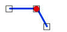

# Coincident

Espacio de nombres: [Digi21.DigiNG.Entities.Relations](../../)  
Ensamblado: [Digi21.DigiNG](../../../)

Indica si el punto y la línea son coincidentes.



```csharp
public static bool Coincident(ReadOnlyPoint point, ReadOnlyLine line)
```

### Parámetros

`point` [ReadOnlyPoint](../../../digi21.diging.entities/readonlypoint/)  
Punto.

`line` [ReadOnlyLine](../../../digi21.diging.entities/readonlyline/)  
Línea.

## Devuelve

[Boolean](https://docs.microsoft.com/en-us/dotnet/api/system.boolean?view=net-5.0)  
_Verdadero_ si el punto y la línea son coincidentes.

