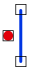

# Disjoint

Espacio de nombres: [Digi21.DigiNG.Entities.Relations](/digi3d-net/programacion/.net/referencia/digi21.diging/digi21.diging.entities.relations/)  
Ensamblado: [Digi21.DigiNG](/digi3d-net/programacion/.net/referencia/digi21.diging.plugin/digi21.diging/)

Indica si el punto y la línea son disjuntos.



```csharp
public static bool Disjoint(ReadOnlyPoint point, ReadOnlyLine line)
```

### Parámetros

`point` [ReadOnlyPoint](/digi3d-net/programacion/.net/referencia/digi21.diging/digi21.diging.entities/clases/readonlypoint/)  
Punto.

`line` [ReadOnlyLine](/digi3d-net/programacion/.net/referencia/digi21.diging/digi21.diging.entities/clases/readonlyline/)  
Línea.

## Devuelve

[Boolean](https://docs.microsoft.com/en-us/dotnet/api/system.boolean?view=net-5.0)  
_Verdadero_ si el punto y la línea son disjuntos.

