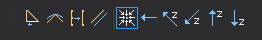

# Acción al finalizar la línea

Permite configurar las acciones que realizará Digi3D.NET al finalizar una línea.

## Botones

* Botón que habilita/deshabilita la variable [C](../ventana-de-dibujo/variables/c/c.md).
* Botón que habilita/deshabilita la variable [S](../ventana-de-dibujo/variables/s/s.md).
* Botón que habilita/deshabilita la variable [G](../ventana-de-dibujo/variables/g/g.md).
* Botón que habilita/deshabilita la variable [P](../ventana-de-dibujo/variables/p/p.md).
* Botón que configura el valor de [IR\_PRINCIPIO](../ventana-de-dibujo/variables/i/ir-principio.md) a no moverse.
* Botón que configura el valor de _IR\_PRINCIPIO_ a desplazarse al origen de la línea.
* Botón que configura el valor de _IR\_PRINCIPIO_ a desplazarse al origen de la línea incrementando la coordenada Z en un múltiplo de la equidistancia.
* Botón que configura el valor de _IR\_PRINCIPIO_ a desplazarse al origen de la línea decrementando la coordenada Z en un múltiplo de la equidistancia.
* Botón que configura el valor de _IR\_PRINCIPIO_ a no desplazarse en X, Y, pero incrementar la coordenada Z en un múltiplo de la equidistancia.
* Botón que configura el valor de _IR\_PRINCIPIO_ a no desplazarse en X, Y, pero decrementar la coordenada Z en un múltiplo de la equidistancia.

