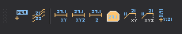

# Acotaciones

Permite ejecutar órdenes relacionadas con acotaciones.

## Botones

* Botón que ejecuta la orden [COTA](../ventana-de-dibujo/ordenes/c/cota.md).
* Botón que ejecuta la orden [ROTULA\_CURVAS](../ventana-de-dibujo/ordenes/r/rotula-curvas.md).
* Botón que ejecuta la orden [DIBUJA\_DISTANCIA](../ventana-de-dibujo/ordenes/d/dibuja_distancia.md).
* Botón que ejecuta la orden [DIBUJA\_DISTANCIA\_3D](../ventana-de-dibujo/ordenes/d/dibuja_distancia_3d.md).
* Botón que ejecuta la orden [DIBUJA\_ALTURA](../ventana-de-dibujo/ordenes/d/dibuja_altura.md).
* Botón que ejecuta la orden [AREA](../ventana-de-dibujo/ordenes/a/area.md).
* Botón que ejecuta la orden [DIBUJA\_PERIMETRO](../ventana-de-dibujo/ordenes/d/dibuja_perimetro.md).
* Botón que ejecuta la orden [DIBUJA\_PERIMETRO\_3D](../ventana-de-dibujo/ordenes/d/dibuja_perimetro_3d.md).
* Botón que ejecuta la orden [PONER\_XY](../ventana-de-dibujo/ordenes/p/poner-xy.md).

