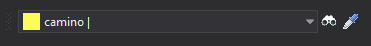

# Código

Permite ejecutar órdenes relacionadas con los códigos.

Este panel se habilita únicamente si seleccionamos la opción **Barra de herramientas mono-codificación** en el campo [Interfaz para seleccionar código](../cuadros-de-dialogo/configuracion/diging.md#interfaz-para-seleccionar-codigo) de la configuración del programa.

## Botones

* Desplegable que permite seleccionar el código activo.
* Botón que ejecuta la orden [COD](../ventana-de-dibujo/ordenes/c/cod.md).
* Botón que ejecuta la orden [CLONAR](../ventana-de-dibujo/ordenes/c/clonar.md).

