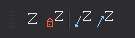

# Coordenada Z

Permite ejecutar órdenes relacionadas con la coordenada Z.

## Botones

* Botón que ejecuta la orden [Z](../ventana-de-dibujo/ordenes/z/z.md).
* Botón que cambia el valor de la variable [FIJAZ](../ventana-de-dibujo/variables/f/fijaz.md).
* Botón que ejecuta la orden [BAJA\_Z](../ventana-de-dibujo/ordenes/b/baja-z.md).
* Botón que ejecuta la orden [SUBE\_Z](../ventana-de-dibujo/ordenes/s/sube-z.md).

