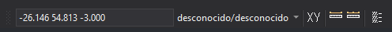

# Coordenadas

Permite realizar tareas relacionadas con las coordenadas X, Y.

## Botones

* Ventana que muestra las coordenadas del dispositivo de entrada en la ventana de dibujo. Esta ventana permite además introducir coordenadas.
* Ventana que nos muestra las unidades de la ventana de dibujo primero en X,Y/Z.
* Botón que ejecuta la orden [XY](../ventana-de-dibujo/ordenes/x/xy.md).
* Botón que ejecuta la orden [MIDE](../ventana-de-dibujo/ordenes/m/mide.md).
* Botón que ejecuta la orden [MIDE+](../ventana-de-dibujo/ordenes/m/mide-mas.md).
* Botón que ejecuta la orden [AGREGA](../ventana-de-dibujo/ordenes/a/agrega.md).

