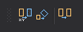

# Copiar y duplicar

Permite ejecutar órdenes relacionadas con copiar y duplicar geometrías.

## Botones

* Botón que ejecuta la orden [COPIAR](../ventana-de-dibujo/ordenes/c/copiar.md).
* Botón que ejecuta la orden [COPIA2P](../ventana-de-dibujo/ordenes/c/copia-2p.md).
* Botón que ejecuta la orden [DUP](../ventana-de-dibujo/ordenes/d/dup.md).

