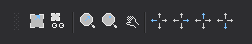

# Desplazamientos de ventana

Permite ejecutar órdenes relacionadas con desplazamientos de la ventana de dibujo.

## Botones

* Botón que activa/desactiva la variable [AUTO\_RATON](../ventana-de-dibujo/variables/a/auto-raton.md).
* Botón que activa/desactiva la variable [AUTO](../ventana-fotogrametrica/ordenes/a/auto.md).
* Botón que ejecuta la orden [ZOOMA](../ventana-de-dibujo/ordenes/z/zooma.md).
* Botón que ejecuta la orden [ZOOMP](../ventana-de-dibujo/ordenes/z/zoomp.md).
* Botón que ejecuta la orden [ZOOM2P](../ventana-de-dibujo/ordenes/z/zoom2p.md).
* Botón que ejecuta la orden [ZOOMIZQ](../ventana-de-dibujo/ordenes/z/zoomizq.md).
* Botón que ejecuta la orden [ZOOMDER](../ventana-de-dibujo/ordenes/z/zoomder.md).
* Botón que ejecuta la orden [ZOOMSUP](../ventana-de-dibujo/ordenes/z/zoomsup.md).
* Botón que ejecuta la orden [ZOOMINF](../ventana-de-dibujo/ordenes/z/zoominf.md).

