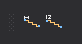

# Escaleras

Permite ejecutar órdenes relacionadas con el dibujo de escaleras.

## Botones

* Botón que ejecuta la orden [ESCALERA](/digi3d-net/referencia/ventana-de-dibujo/ordenes/e/escalera.md).
* Botón que ejecuta la orden [ESCALERA_DA](../ventana-de-dibujo/ordenes/e/escalera-da.md).
