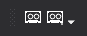

# Macro

Permite la grabación de macros que se podrán almacenar en una pulsación de tecla.

## Botones

* Botón para comenzar la grabación de la macro. Cuando se pulsa la ventana de dibujo muestra un cuadro de color rojo para indicar que se está almacenando una macro.
* Botón para finalizar la grabación de la macro. Cuando se pulsa muestra un cuadro de diálogo solicitando dónde almacenar la macro.  Si seleccionamos por ejemplo una pulsación de tecla, se nos invitará a pulsar una tecla. Al pulsar la tecla se mostrará el cuadro de diálogo de la orden [TECLA ](../ventana-de-dibujo/ordenes/t/tecla.md)con la secuencia de órdenes que hayamos ejecutado preconfigurada.

