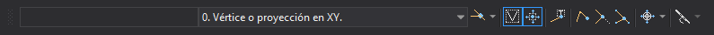

# Tentativo

Esta barra de herramientas permite realizar acciones relacionadas con los tentativos y modos de búsqueda.

## Botones

* Ventana que muestra las coordenadas del tentativo \(snap\) activo.
* Desplegable que permite seleccionar un [modo de búsqueda](../ventana-de-dibujo/variables/m/modob.md).
* Botón que permite activar/desactivar el estado de la variable [AUTOMODOB](../ventana-de-dibujo/ordenes/a/automodob.md).
* Botón que permite activar/desactivar el estado de la variable [VER](../ventana-de-dibujo/variables/v/ver.md).
* Botón que permite activar/desactivar el estado de la variable [IR\_TENTATIVO](../ventana-de-dibujo/variables/i/ir_tentativo.md).
* Botón que permite activar/desactivar el estado de la variable [TENTATIVO\_TEXTOS](../ventana-de-dibujo/variables/t/tentativo-textos.md).
* Botón que permite activar/desactivar el estado de la variable [TENTATIVO\_FIN](../ventana-de-dibujo/variables/t/tentativo-fin.md).
* Botón que permite activar/desactivar el estado de la variable [TENTATIVO\_CORTA](../ventana-de-dibujo/variables/t/tentativo-corta.md).
* Botón que permite activar/desactivar el estado de la variable [TENTATIVO\_INSERTA](../ventana-de-dibujo/variables/t/tentativo-inserta.md).
* Botón que permite activar/desactivar el estado de la variable [CURSOR](../ventana-de-dibujo/ordenes/c/cursor.md).
* Botón que permite activar/desactivar el estado de la variable [MOSTRAR\_PASO\_CURVAS](../ventana-de-dibujo/variables/m/mostrar_paso_curvas.md).

