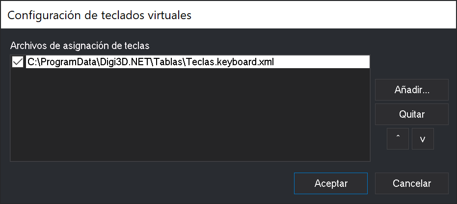

# Configuración de teclados virtuales

Este cuadro de diálogo te permite indicar la ubicación de los archivos de configuración de teclas.

## Abrir el cuadro de diálogo

Para abrir este cuadro de diálogo selecciona la opción del menú **Herramientas/Configuración de teclados virtuales**. Esta opción del menú no aparece si tienes alguna ventana de dibujo o fotogramétrica abierta. Únicamente aparece en el menú que muestra el programa cuando no tienes ninguna ventana abierta.

## Uso del cuadro de diálogo

* Pulsando el botón **Añadir** podemos seleccionar archivos a añadir.
* Pulsando el botón **Quitar** podemos eliminar el archivo seleccionado.
* Con las flechas de **Arriba** y **Abajo** podemos cambiar el orden de carga de los archivos.
* Podemos deshabilitar la carga de un archivo sin necesidad de eliminarlo. Para ello tan sólo tenemos que deshabilitar el archivo quitando la marca en el botón de chequeo que aparece a la izquierda de cada archivo.

## Observaciones

Al abrir una ventana de dibujo o una ventana fotogramétrica se cargarán en memoria todos los archivos de configuración de teclas que indiques en este cuadro de diálogo \(y que tengan marcado el botón de chequeo que aparece a la izquierda de la ruta del archivo de configuración de teclas\).

En caso de tener cargado más de un archivo de configuración de teclas, puedes cambiar de uno a otro mediante:

* La orden [CAMBIA\_TECLAS\_MNU](../ventana-de-dibujo/ordenes/c/cambia-teclas-mnu.md).
* El desplegable de la [Barra de herramientas Teclados](../barras-de-herramientas/teclados.md).

