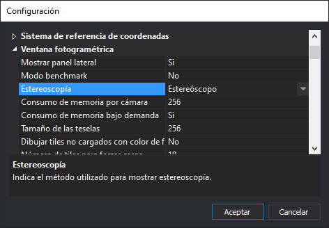

# Configuración

Este cuadro de diálogo permite configurar todos los aspectos Digi3D.NET.

## Abrir el cuadro de diálogo

Para abrir este cuadro de diálogo selecciona la opción del menú **Herramientas/Configuración**.

## Uso del cuadro de diálogo

Las configuraciones están agrupadas por categorías. 

Para cambiar una configuración sigue los siguientes pasos:

* Localiza la categoría donde está la configuración que quieres realizar.
* Abre la categoría haciendo doble clic o pulsando la flecha de la izquierda.
* Localiza dentro de la categoría el parámetro que quieres cambiar.
* Cambia el valor.
* Pulsa el botón **Aceptar**.

## Observaciones

Las configuraciones que hemos considerado que son para el usuario se almacenan en la clave **Computer\HKEY\_CURRENT\_USER\SOFTWARE\Digi21\Digi3D.NET**.

Las configuraciones de máquina históricamente se almacenaban en el registro en LOCAL\_MACHINE, pero almacenar ahí información requiere ser administrador y eso era problemático en ciertas instituciones, de manera que cambiamos la ubicación de la configuración de máquina a una base de datos _sqlite_ almacenada en la ruta **C:\ProgramData\Digi3D.NET\Digi3DNET.db.**

