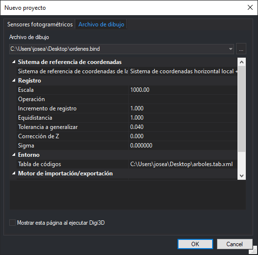

# Nuevo proyecto

Este cuadro de diálogo permite cargar un modelo fotogramétrico en la ventana fotogramétrica o un archivo de dibujo en la ventana de dibujo, en función de si la pestaña activa es [Sensores fotogramétricos](sensores-fotogrametricos.md) o [Archivo de dibujo](archivo-de-dibujo.md).

