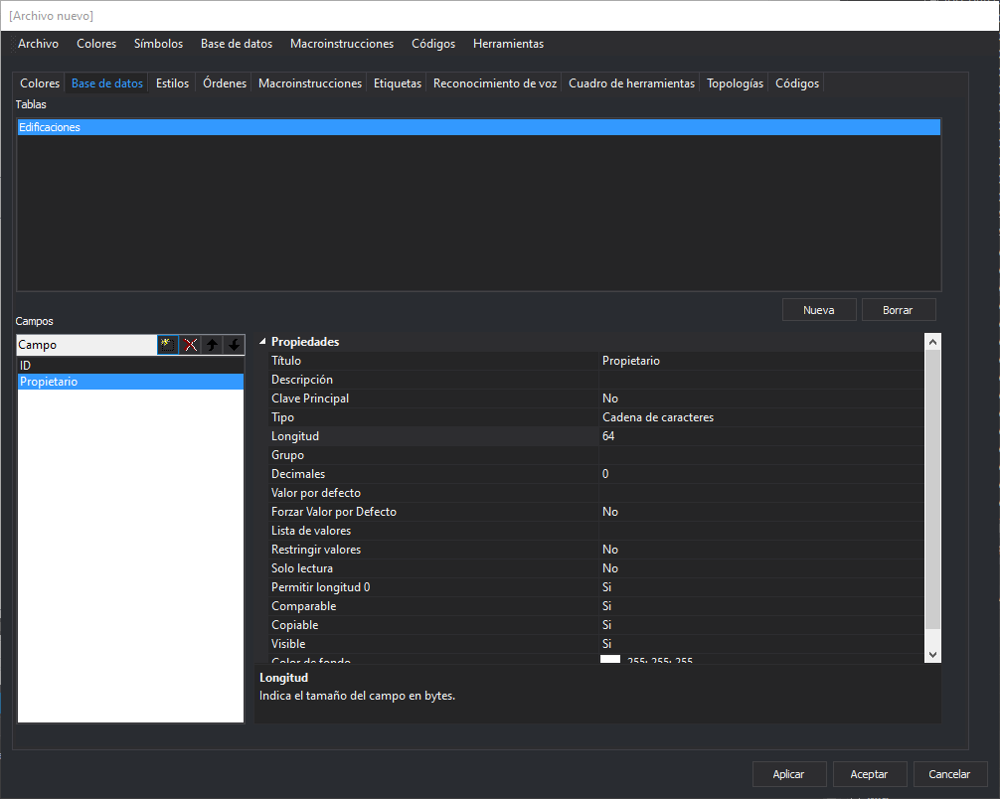

# Base de datos

Permite configurar las tablas y los esquemas de cada una de estas tablas de base de datos.

## Tablas

Muestra las tablas de base de datos definidas en esta tabla de códigos.

### Botón Nueva

Permite añadir una nueva tabla al listado de tablas.

### Botón Borrar

Permite eliminar la tabla seleccionada en el listado de tablas.

## Campos

Muestra los campos de la tabla seleccionada en **Tablas**.

Esta ventana tiene una barra de herramientas con los siguientes botones:

* **Nuevo** Al pulsarlo se creará un nuevo campo en la tabla. Debemos introducir el nombre del campo.
* **Eliminar** Elimina el campo seleccionado en el listado de campos.
* **Subir** Cambia el orden de los campos en la tabla subiendo de posición el seleccionado en el listado de campos.
* **Bajar** Cambia el orden de los campos en la tabla bajando de posición el seleccionado en el listado de campos.

Al seleccionar un campo, aparecerán sus [propiedades](propiedades-de-los-campos.md) en la parte derecha.
