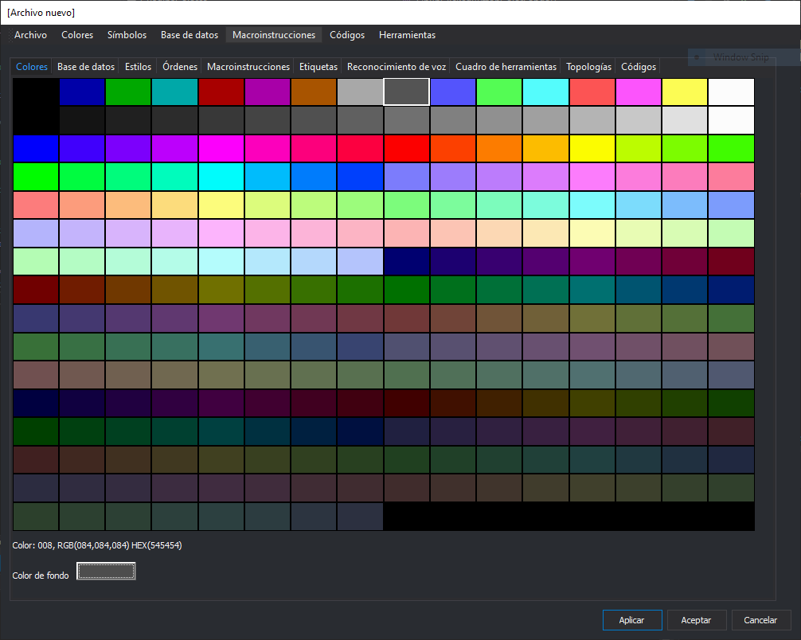

# Colores

Esta pestaña permite configurar la paleta de colores para la representación de códigos o para la orden [COLOR_FONDO](/digi3d-net/referencia/ventana-de-dibujo/variables/c/color-fondo.md) en la ventana de dibujo con esta tabla de códigos activa.

## Paleta de colores

Permite configurar el color que tendrá asignado cada una de las 256 entradas de la paleta. Pulsando sobre cualquier color de la paleta nos aparece un cuadro de diálogo que nos permite cambiar dicho color.

El programa tiene preconfiguradas tres paletas de color estándar que se pueden seleccionar mediante las opciones del menú:

* **Colores/Estándar de Digi** Configura la paleta de colores estándar de Digi3D.
* **Colores/Estándar de MicroStation** Configura la paleta de colores estándar de MicroStation.
* **Colores/Estándar de MicroStation (256 colores)** Configura la paleta de colores estándar de MicroStation de 256 colores.

## Color de fondo

Al pulsar el botón podremos cambiar el color de fondo que tendrá la ventana de dibujo al cargar esta tabla de códigos.
