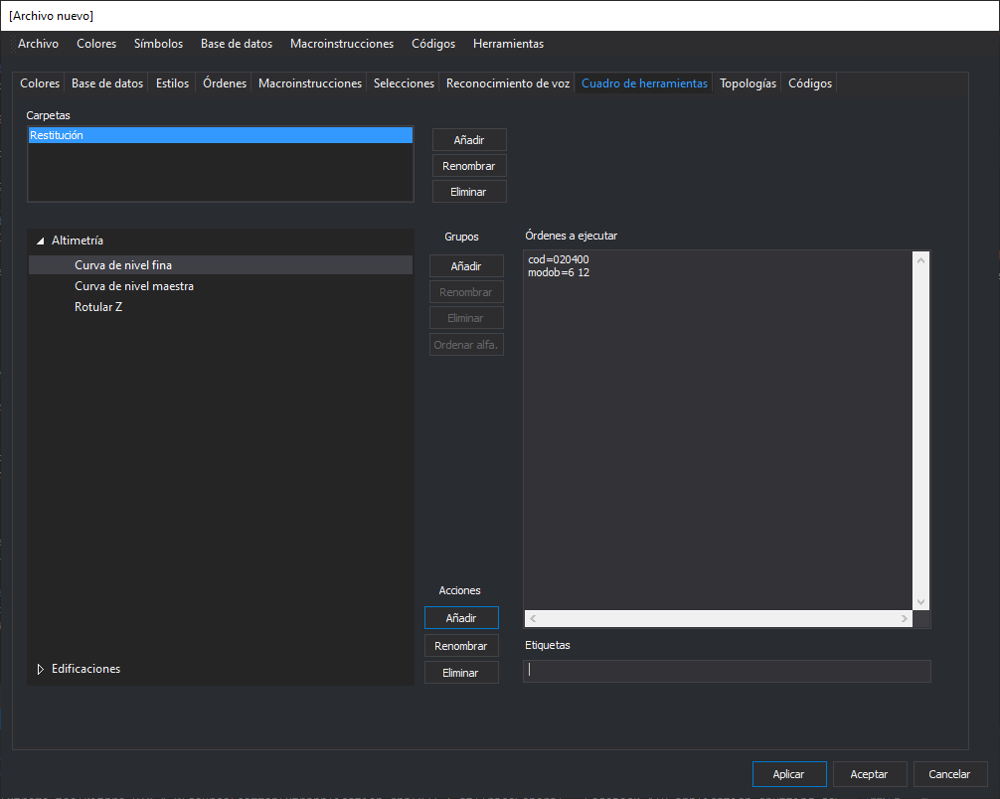

# Cuadro de herramientas

Permite configurar el contenido que mostrará el panel [Cuadro de herramientas](/digi3d-net/referencia/editor-de-tablas-de-codigos/pestanas/cuadro-de-herramientas.md) de Digi3D.NET al abrir un archivo de dibujo con esta tabla de códigos.

## Ventanas

* Una lista de carpetas y botones para añadir, renombrar y eliminar carpetas.
* Una lista de grupos o categorías y botones para añadir, renombrar, eliminar y ordenar alfabéticamente los grupos.
* Botones para añadir, renombrar y eliminar opciones dentro del grupo seleccionado.
* Una ventana de contenido principal para añadir las órdenes a ejecutar al seleccionar la opción.
