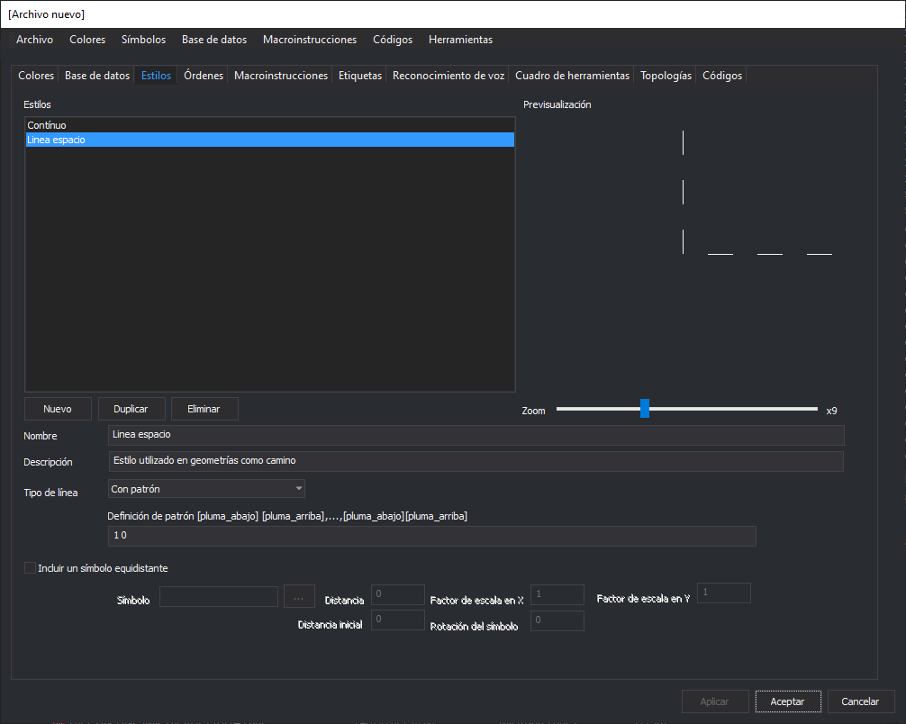

# Estilos



Permite configurar los estilos con los que se representarán las geometrías.

## Estilos

Muestra un listado con los estilos que implementa la tabla de códigos.

### Botón Nuevo

Permite crear un nuevo estilo.

### Botón Duplicar

Duplica el estilo seleccionado.

### Botón Eliminar

Elimina el estilo seleccionado.

### Nombre

Permite indicar el nombre del estilo. Este nombre se actualizará en el listado de Estilos al pulsar el botón **Aplicar**.

No se puede asignar el mismo nombre a dos estilos distintos.

### Descripción

Permite especificar una descripción opcional al estilo.

### Tipo de línea

En caso de que la geometría cuyo código referencia a este estilo sea una línea, indica el tipo de línea que se dibujará.

Se pueden seleccionar una de las siguientes opciones:

* **Invisible** No se mostrará ninguna línea base.
* **Continua** Se dibujará una línea continua.
* **Con patrón** Se dibujará una línea según lo especificado en el campo [Patron](estilos.md#patron).

> Si la geometría cuyo código tiene asignado este estilo es puntual, se hará caso omiso al valor seleccionado en este campo.

### Patrón

Permite configurar el patrón con el que se dibujará una línea mediante pares de valores (pluma abajo, pluma arriba).

El valor: **pluma abajo** indica que se dibujará línea.

El valor: **pluma arriba** indica que se dibujará un espacio.

Por ejemplo: Para crear un patrón que sea `---- - ---- - ----`introduciremos el siguiente valor:

```
4 1 1 1
```

Que significa:

* Dibuja una línea de 4 unidades.
* Deja un espacio de 1 unidad.
* Dibuja una línea de 1 unidad.
* Deja un espacio de 1 unidad.

## Incluir un símbolo equidistante

Si se habilita permite indicar un símbolo que se dibujará a lo largo de la línea o el símbolo con el que se representará la geometría de tipo punto.

### Símbolo

Permite indicar el símbolo a asignar al estilo. Los símbolos son archivos de dibujo con extensión .BIN ubicados en un determinado directorio, habitualmente _c:\ProgramData\Digi3D.NET\Símbolos_

Al pulsar el botón de los tres puntos aparecerá un cuadro de diálogo que te mostrará todos los símbolos. Al aceptar el cuadro de diálogo se actualizará la ventana **Símbolo**.

> Si no localizas el símbolo que buscas asegúrate de que el programa está localizando los símbolos en la carpeta adecuada mediante la opción del menú Herramientas/Configuración

### Distancia

Permite indicar cada cuanta distancia aparecerá el símbolo a lo largo de la línea.

> Si se especifica un 0 en este campo no se dibujará el símbolo en la línea

### Distancia inicial

Permite indicar la distancia con respecto al primer vértice de la línea a la que se dibujará el primer símbolo.

### Factor de escala en X

Permite indicar el factor de escala en horizontal del símbolo.

> Si se introduce un 0 aquí no se mostrará el símbolo

### Factor de escala en Y

Permite indicar el factor de escala en vertical del símbolo.

> Si se introduce un 0 aquí no se mostrará el símbolo

### Rotación del símbolo

Permite especificar una rotación en grados sexagesimales con la que se dibujará el símbolo.
