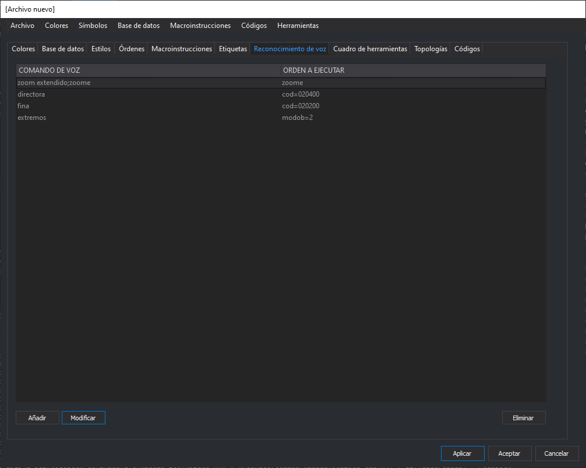

# Reconocimiento de voz

Esta pestaña permite que añadamos comandos a ejecutar mediante los servicios de reconocimiento de voz de Windows si está habilitada la variable global [RECONOCER_VOZ](/digi3d-net/referencia/ventana-de-dibujo/variables/r/reconocer-voz.md).

Muestra en el contenido principal una lista de los comandos de voz configurados. Al seleccionar uno de ellos, se habilitan los botones **Modificar** y **Eliminar**.

## Botón Añadir

Permite añadir un nuevo comando de voz.

Al pulsarlo aparece un cuadro de diálogo que permite añadir distintas frases (separadas por punto y coma) que desencadenan que se ejecute el comando.

Después indicaremos el comando a ejecutar.

## Botón Modificar

Permite modificar el comando de voz seleccionado en la lista de comandos de voz.

## Botón Eliminar

Permite eliminar el comando de voz seleccionado en la lista de comandos de voz.
