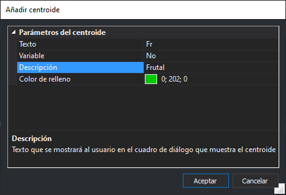

# Añadir centroide

Permite añadir un centroide a la topología.

## Texto

Texto almacenar en el archivo de dibujo al insertar un centroide de este tipo.

## Variable

Indica si el texto a almacenar es variable.

En caso de ser variable se podrán introducir como centroides por ejemplo nombres de calles.

## Descripción

Texto que se mostrará al usuario en el cuadro de diálogo de inserción de centroides para representar este centroide.

> Podemos introducir aquí "Frutal" para el texto de centroide "Fr", de esta manera se facilitará al operador la selección del centroide correcto

## Color de relleno

Configura el color que se utilizará para rellenar los [polígonos topológicos](poligonos-topologicos.md) que tengan este centroide asociado.
