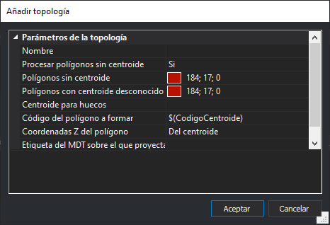

# Añadir topología

Permite configurar una nueva topología a añadir al listado de topologías de la tabla de códigos.

## Nombre

Permite configurar el nombre de la topología. Este será el nombre de cada una de las opciones que se mostrarán en los menús dinámicos del menú [Topología](/digi3d-net/referencia/ventana-de-dibujo/menus/topologia.md).

## Procesar polígonos sin centroide

Indica si el analizador de topologías debe mostrar un error por cada [polígono topológico](poligonos-topologicos.md)localizado sin un centroide.

## Polígonos sin centroide

Permite configurar el color con el que se rellenarán los _polígonos topológicos_ sin [centroide](centroide.md).

Lo habitual es poner un color fuerte como rojo puro para identificar rápidamente aquellos polígonos topológicos que no tienen centroide asociado.

## Polígonos con centroide desconocido

Permite configurar el color con el que se rellenarán los polígonos topológicos que tengan un centroide que no esté enumerado entre el conjunto de centroides especificados para la topología.

## Centroide para huecos

Permite indicar el texto que tendrán los centroides que se considerarán [huecos](centroide.md#huecos)para la topología.

## Código del polígono a formar

Permite configurar el código con el que se [generarán los polígonos](/digi3d-net/referencia/ventana-de-dibujo/menus/topologia.md) de esta topología.

Este campo admite que se introduzca una [macro](/digi3d-net/referencia/macros.md) como, por ejemplo `$(CodigoCentroide)`o `$(TextoCentroide)`

## Coordenadas Z del polígono

Permite indicar de dónde se extraerá la coordenada Z de cada uno de los vértices del polígono a formar.

Se puede seleccionar una de las siguientes opciones:

* **Del centroide** Indica que todos los vértices del polígono tendrán como coordenada Z la coordenada Z del centroide del polígono.
* **2.5D a partir de las geometrías del polígono** Indica que se formará un polígono utilizando las coordenadas Z de las geometrías que lo forman. En caso de aquellos nodos en los que no coincida la coordenada Z de las líneas que llegan a él, se introducirá en el polígono formado uno de ellos.
* **3D a partir de las geometrías del polígono** Indica que se formará un polígono utilizando las coordenadas Z de las geometrías que lo forman. En caso de aquellos nodos en los que no coincida la coordenada Z de las líneas que llegan a él, se introducirán ambas coordenadas Z para formar un polígono en 3D.
* **Proyectar sobre un MDT cargado** Indica que se extraerán las coordenadas Z de los archivos MDT cargados en el momento de transformar la topología en polígono.

## Etiqueta del MDT sobre el que proyectar

En caso de que en el campo [Coordenadas Z del polígono](anadir-topologia.md#coordenadas-z-del-poligono) se configure la opción **Proyectar sobre un MDT cargado** se puede configurar aquí una etiqueta.

En caso de configurar aquí una etiqueta, únicamente se utilizarán los archivos MDT que tengan asociada esta etiqueta.

> Podemos tener cargados por ejemplo varios archivos GeoTIFF, algunos con la etiqueta MDT y otros con la etiqueta MDS. Si queremos que los polígonos de una determinada topología se proyecten con los MDSs introduciremos aquí la palabra MDS.
