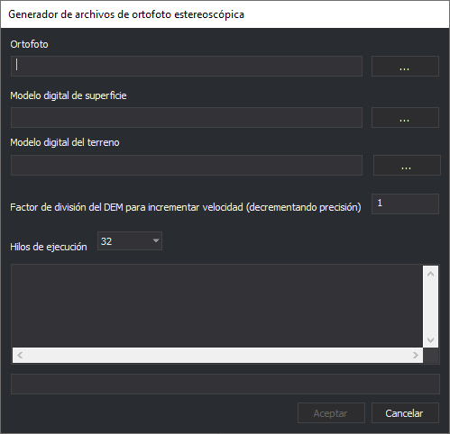

# Generador de archivos de Ortofoto Estereoscópica

Permite crear archivos HMP (Heigh Map Pyramidal) para el sensor Ortofoto Estereoscópica de Digi3D.NET.

## Observaciones

El sensor Ortofoto Estereoscópica muestra estereoscópicamente ortofotos proyectando la ortofoto contra un modelo digital de superficies o un modelo digital del terreno.

Los archivos HPM deben tener al menos un modelo digital. Podemos crearlos con un modelo digital de superficies, un modelo digital del terreno o ambos. 

## Ortofoto

Introduce aquí la ruta de la ortofoto.

## Modelo digital de superficie

Introduce aquí el archivo GeoTIFF con el modelo digital de superficie.

Este campo no es obligatorio, pero en caso de no proporcionar un modelo digital de superficie el programa exigirá que se proporcione un modelo digital del terreno.

## Modelo digital del terreno

Introduce aquí el archivo GeoTIFF con el modelo digital del terreno.

Este campo no es obligatorio, pero en caso de no proporcionar un modelo digital del terreno el programa exigirá que se proporcione un modelo digital de superficie.

## Hilos de ejecución

Este desplegable nos permitirá indicar cuántos hilos de ejecución (el valor mostrado variará en función del número de núcleos y procesadores del ordenador en el que se ejecute el programa) utilizar. 

Mientras mayor sera este valor más rápido será el proceso, pero más lentas se volverán el resto de las tareas del sistema operativo.

## Aceptar

Pulsa este botón para comenzar el proceso de creación del archivo de ortofoto estereoscópica.

Este botón se habilitará únicamente si se ha indicado la ruta de la ortofoto y de al menos uno de los dos campos de modelo digital.

## Cancelar

Pulsa este botón para finalizar el programa.

