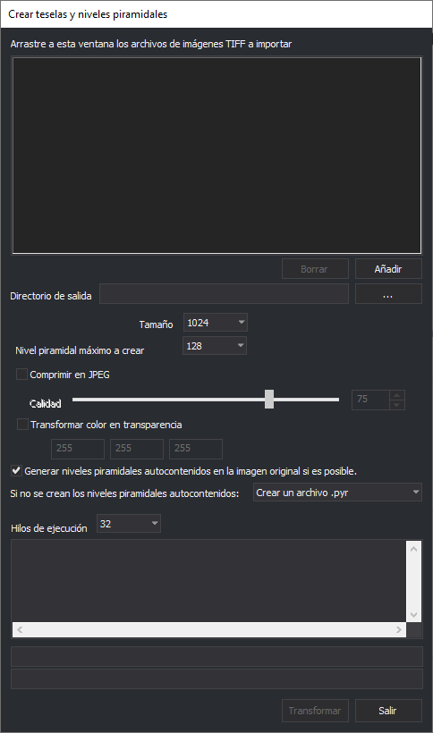

# Generador de Niveles Piramidales

Este programa transforma imágenes TIFF en batería para hacerlas compatibles con Digi3D.NET y crea niveles piramidales.

## Observaciones

Digi3D.NET requiere que las imágenes TIFF estén teseladas (formadas por un mosaico de imágenes pequeñas).

Digi3D.NET requiere además que las imágenes TIFF tengan niveles piramidales (que son la misma imagen, pero a distintas resoluciones). Estos niveles piramidales pueden estar autocontenidos dentro de la propia imagen TIFF o en un archivo externo (habitualmente un archivo con extensión .pyr, que es en realidad un archivo TIFF al que se le ha cambiado la extensión a .pyr y que tiene los niveles piramidales 2, 3, 4,...).

Si al cargar en Digi3D.NET una imagen TIFF el programa detecta que esta no está formada por teselas, mostrará un cuadro de diálogo solicitando si convertirla en compatible.&#x20;

Si al cargar en Digi3D.NET una imagen TIFF el programa detecta que está teselada pero no tiene niveles piramidales, Digi3D.NET **no va a preguntar** si convertir la imagen en una imagen compatible, puesto que ya es compatible.

Con el programa Generador de Niveles Piramidales podemos realizar en batería lo siguiente:

* Convertir un conjunto de imágenes TIFF no compatibles (sin teselas) en compatibles y de paso generarles sus niveles piramidales.
* Crear niveles piramidales a archivos TIFF existentes no compatibles (sin teselas).

## Arrastre a esta ventana los archivos de imágenes TIFF a importar

Abriremos un explorador de archivos y seleccionaremos los archivos a transformar y mediante la técnica de Arrastrar y Soltar soltaremos los archivos en esta ventana.

De entre todos los archivos que arrastremos únicamente se seleccionarán los archivos TIFF.

### Botón Borrar

Elimina de la lista de archivos TIFF a transformar los archivos seleccionados.

### Botón Añadir

Al pulsarlo se abre un cuadro de diálogo que nos permite seleccionar archivos TIFF a transformar.

## Directorio de salida

Este campo es opcional, y en caso de introducir aquí alguna ruta, el programa generará las imágenes resultantes en dicho directorio.

## Tamaño

Indica el tamaño de la tesela a crear. El valor habitual es 1024.

## Nivel piramidal máximo a crear

Selecciona aquí el nivel piramidal máximo a crear. Este nivel será el máximo que podrá seleccionarse en el desplegable de niveles piramidales de la barra de estado de la ventana fotogramétrica.

## Comprimir en JPEG

Selecciona esta opción si quieres que Digi3D.NET comprima la imagen generada en formato JPEG.\
No es habitual seleccionar esta opción pues Digi3D.NET genera y carga archivos BigTIFF que no tienen limitación en el tamaño.

### Calidad

Selecciona la calidad del JPEG. Mientras mayor sea la calidad menos comprimida estará la imagen.

## Transformar color en transparencia

Es posible que la imagen original no tenga canal de transparencia pero que tenga un color especial que signifique transparencia.

Si habilitamos esta opción el programa generará un archivo con canal de transparencia y aquellos píxeles que tengan el color seleccionado se convertirán en transparentes.

En caso de seleccionar esta opción se habilirarán las ventanas para introducir el valor de Rojo, Verde y Azul que identifiquen el color transparente.

## Generar niveles piramidales autocontenidos en la imagen original si es posible

Si la imagen original no está teselada se podrán generar los niveles piramidales autocontenidos. En caso contrario no.

Con esta opción podemos indicar si queremos que los niveles piramidales sean autocontenidos de manera que el resultado será un único archivo TIFF con las teselas y con los niveles piramidales.

### Si ni se crean los niveles piramidales autocontenidos

Este desplegable nos permite indicar si queremos que los niveles piramidales se creen en un archivo .pyr  o si queremos un archivo .TIFF para cada nivel piramidal.

## Hilos de ejecución

Este desplegable nos permitirá indicar cuántos hilos de ejecución (el valor mostrado variará en función del número de núcleos y procesadores del ordenador en el que se ejecute el programa) utilizar.&#x20;

Mientras mayor sera este valor más rápido será el proceso pero más lentas se volverán el resto de tareas del sistema operativo.

## Transformar

Pulsa este botón para comenzar el proceso.

## Salir

Pulsa este botón para finalizar la aplicación.

