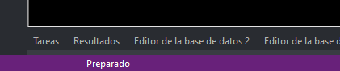

# Modo preparado

Digi3D.NET está en modo preparado cuando no está ejecutando ninguna orden.

Podemos saber si el programa está en modo preparado porque en caso de ser así, en la barra de estado de la aplicación mostrará el mensaje **Preparado.**

