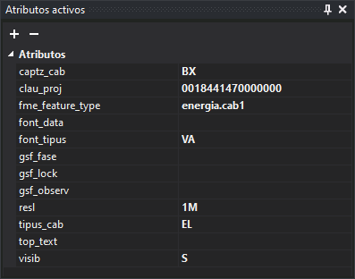

# Atributos Activos

<figure><figcaption>
Panel Atributos Activos con algunos atributos
</figcaption></figure>

Este panel permite añadir atributos a asignar a la geometría.

Los atributos son pares clave-valor en los que se almacena información de cualquier tipo. Se pueden añadir hasta 65535 atributos a una geometría.

## Barra de herramientas

Dispone de una barra de herramientas que permite interactuar con el contenido del panel.

### Botones

* Botón que añade un atributo nuevo al listado de códigos activos.
* Botón elimina el atributo activo seleccionado.

