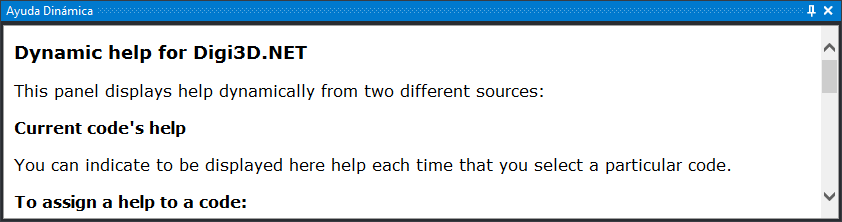

# Ayuda dinámica

Este panel permite mostrar ayuda asociada a un código, así como muestra la ayuda de una determinada orden.

## Mostrar el panel

Se puede mostrar el panel de las siguientes formas:

* Pulsando el botón correspondiente en la [barra de herramientas Paneles](../barras-de-herramientas/paneles.md).
* Mediante la opción del menú **Ayuda/Ayuda dinámica**.

