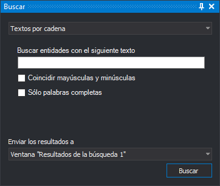

# Buscar

Permite buscar geometrías según un criterio.

Dispone de un desplegable en el que seleccionamos el tipo de búsqueda que queremos realizar. En función del tipo de búsqueda el programa nos mostrará en el contenido principal del panel distintas opciones.

El último desplegable nos permite enviar el resultado de la búsqueda a una de las siguientes opciones:

* Panel Resultados de la búsqueda 1 o 2.
* A la orden activa \(orden que se esté ejecutando en este momento\).

Si se está ejecutando una orden que admita selección múltiple de geometrías y seleccionamos en el campo _Enviar los resultados a_ la opción **Orden activa**, el programa enviará automáticamente las geometrías localizadas a la orden activa. Esta orden realizará la tarea que le corresponda.

## Ejemplo

Supongamos que queremos exportar todos los textos del archivo de dibujo a un archivo nuevo. Podemos hacerlo siguiendo las siguientes instrucciones.

* Seleccionamos la opción del menú **Archivo/Exportar entidades seleccionadas...**
* Abrimos el panel de búsqueda mediante la opción **Editar/Buscar**.
* Seleccionamos la opción **Todos los textos**.
* Pulsamos el botón **Buscar**.
* Introducimos el nombre del archivo a crear.
* Pulsamos el botón **Guardar**.

